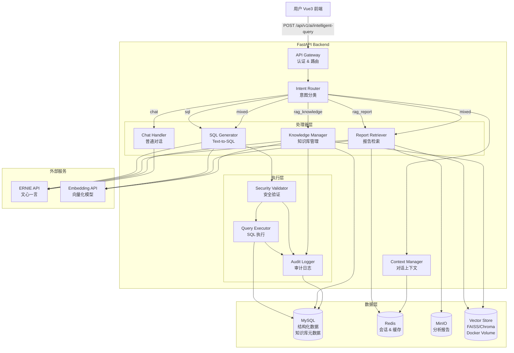
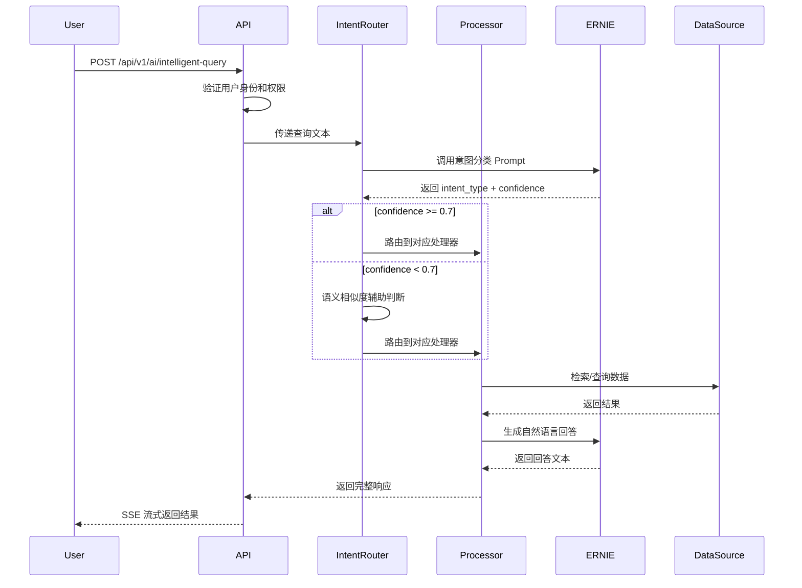
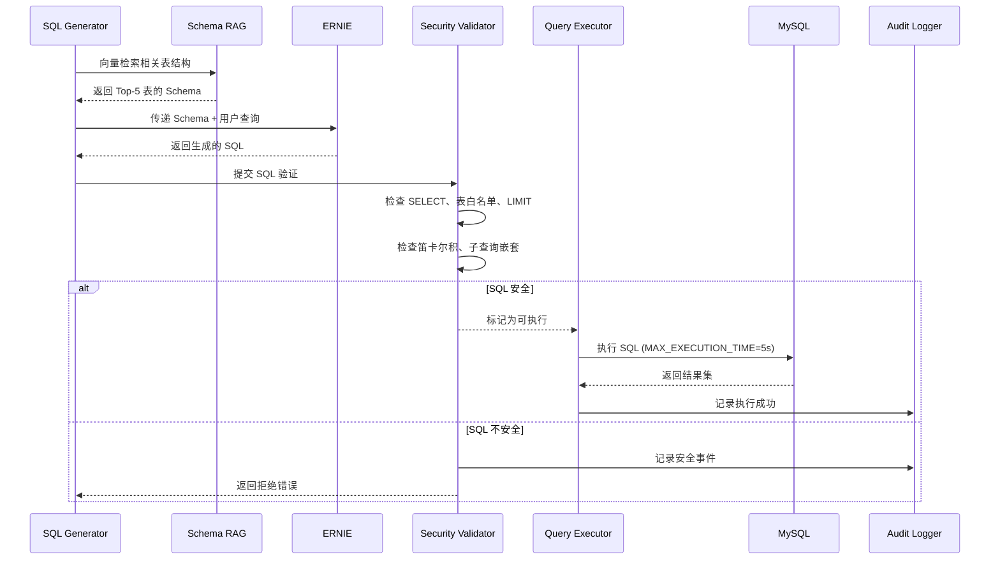
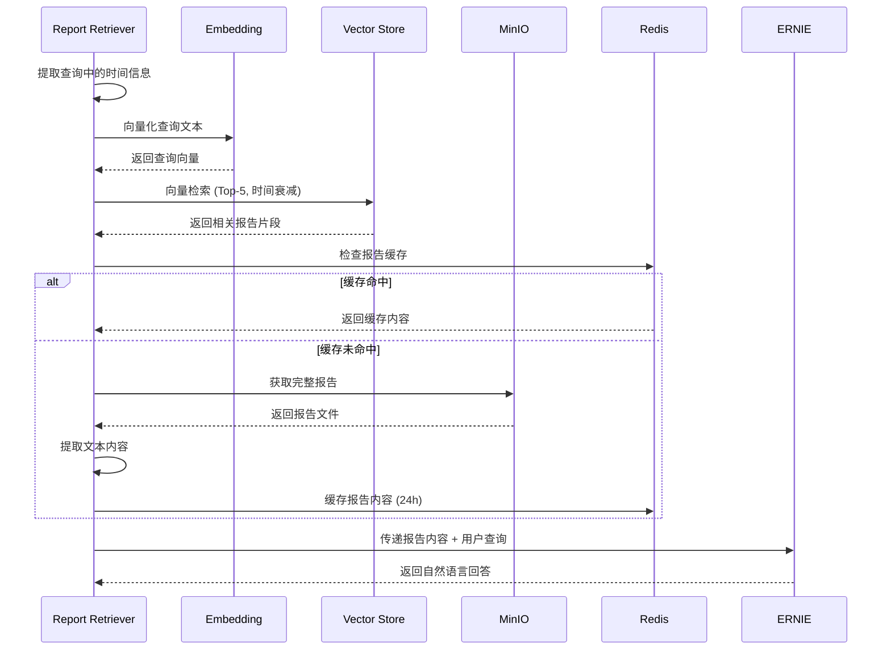
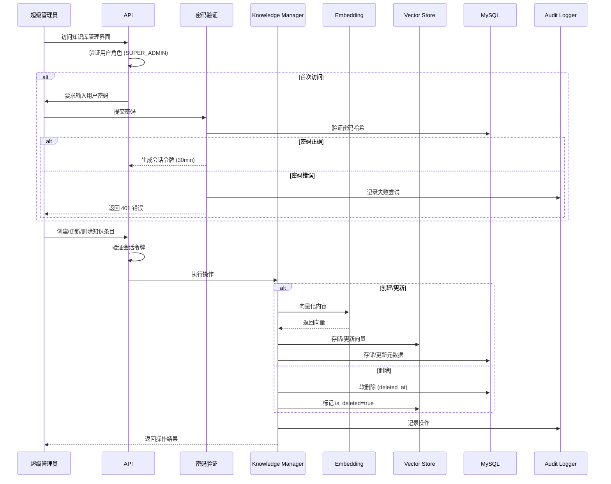

# Design Document: AI 智能查询功能

## Overview

AI 智能查询功能是一个基于 RAG（检索增强生成）+ Text-to-SQL 混合架构的智能问答系统，允许用户通过自然语言查询多种数据源，包括结构化数据（MySQL）、分析报告（MinIO）和知识库内容。系统使用百度文心一言（ERNIE）API 进行自然语言理解和生成，通过向量数据库实现语义检索。

### 核心能力

1. **自然语言查询**：用户使用自然语言提问，无需了解数据库结构或报告存储位置
2. **智能意图识别**：基于 LLM 的意图分类，自动判断查询类型（SQL/报告检索/知识库检索/普通对话/混合）
3. **Text-to-SQL**：将自然语言转换为安全的 SQL 查询，支持 Schema RAG 优化
4. **报告语义检索**：从 MinIO 存储的 HTML/JSON 报告中检索相关内容
5. **知识库管理**：支持手动添加和自动生成的知识条目，提供团队经验沉淀
6. **多轮对话**：维护对话上下文，支持代词引用和实体追踪
7. **流式响应**：通过 SSE 实时返回处理状态和结果

### 技术栈

- **后端框架**：FastAPI (Python)
- **数据库**：MySQL（结构化数据 + 知识库元数据）
- **缓存**：Redis（会话管理、对话历史、报告缓存）
- **对象存储**：MinIO（分析报告、向量数据库备份）
- **向量数据库**：FAISS 或 Chroma（持久化在 Docker volume）
- **AI 服务**：百度文心一言 ERNIE API（远程调用，非本地部署）
- **Embedding 模型**：百度文心 Embedding API 或 bge-small-zh
- **前端框架**：Vue 3

### 设计原则

1. **安全优先**：多层 SQL 安全验证，仅允许 SELECT 查询，表白名单控制
2. **权限集成**：与现有 RBAC 系统集成，用户仅能访问有权限的数据
3. **性能优化**：Schema RAG 减少 Token 消耗，报告缓存提升响应速度
4. **可观测性**：完整的审计日志，记录所有查询操作和安全事件
5. **渐进式增强**：先实现核心功能，逐步扩展高级特性


## Architecture

### System Architecture Diagram



### Component Interaction Flow

#### 1. 查询处理主流程



#### 2. SQL 查询流程




#### 3. 报告检索流程



#### 4. 知识库管理流程




## Components and Interfaces

### 1. API Gateway

**职责**：
- 接收前端请求，验证用户身份和权限
- 路由请求到对应的处理器
- 实现 SSE 流式响应

**接口**：

```python
# 主查询接口
POST /api/v1/ai/intelligent-query
Request:
{
  "query": str,              # 用户查询文本 (必填, ≤1000字符)
  "session_id": str,         # 会话ID (可选, 用于多轮对话)
  "include_details": bool    # 是否包含详细数据 (可选, 默认false)
}

Response (SSE Stream):
{
  "status": "analyzing_intent" | "querying_data" | "generating_answer" | "completed",
  "message": str,
  "data": {
    "answer": str,                    # 自然语言回答
    "source_type": "database" | "report" | "knowledge" | "mixed",
    "sql": str,                       # 执行的SQL (如有)
    "query_results": [...],           # 原始查询结果 (如有)
    "referenced_reports": [...],      # 引用的报告列表 (如有)
    "referenced_knowledge": [...],    # 引用的知识条目 (如有)
    "execution_time_ms": int
  },
  "error": {
    "code": str,
    "message": str
  }
}

# 获取可查询表列表
GET /api/v1/ai/query-tables
Response:
{
  "tables": [
    {
      "name": str,
      "description": str,
      "columns": [...]
    }
  ]
}

# 获取报告索引
GET /api/v1/ai/report-index
Query Params:
  - report_type: str (可选)
  - start_date: str (可选)
  - end_date: str (可选)
Response:
{
  "reports": [
    {
      "task_id": str,
      "report_type": str,
      "generated_at": str,
      "summary": str,
      "file_path": str
    }
  ]
}
```

### 2. Intent Router

**职责**：
- 使用 ERNIE API 进行意图分类
- 语义相似度辅助判断（置信度 < 0.7 时）
- 路由请求到对应处理器

**核心逻辑**：

```python
class IntentRouter:
    def __init__(self):
        self.typical_queries = self._load_typical_queries()  # 50+ 示例
        self.embedding_model = EmbeddingModel()
    
    async def classify_intent(self, query: str, context: dict) -> IntentResult:
        # 1. 调用 ERNIE API 进行意图分类
        prompt = self._build_intent_classification_prompt(query, context)
        response = await self.ernie_client.chat(prompt)
        intent_data = json.loads(response)
        
        # 2. 如果置信度低，使用语义相似度辅助
        if intent_data["confidence"] < 0.7:
            semantic_intent = self._semantic_similarity_fallback(query)
            if semantic_intent["confidence"] > intent_data["confidence"]:
                intent_data = semantic_intent
        
        # 3. 如果仍然无法确定，降级到关键词规则
        if intent_data["confidence"] < 0.5:
            intent_data = self._keyword_based_routing(query)
        
        return IntentResult(
            intent_type=intent_data["intent_type"],
            confidence=intent_data["confidence"],
            processors=intent_data.get("processors", [])
        )
    
    def _semantic_similarity_fallback(self, query: str) -> dict:
        query_embedding = self.embedding_model.encode(query)
        similarities = []
        
        for typical_query in self.typical_queries:
            typical_embedding = typical_query["embedding"]
            similarity = cosine_similarity(query_embedding, typical_embedding)
            similarities.append({
                "intent_type": typical_query["intent_type"],
                "similarity": similarity
            })
        
        best_match = max(similarities, key=lambda x: x["similarity"])
        return {
            "intent_type": best_match["intent_type"],
            "confidence": best_match["similarity"]
        }
```

**意图分类 Prompt 模板**：

```
你是一个意图分类专家。请分析用户的查询意图，返回 JSON 格式结果。

可能的意图类型：
- sql: 查询实时数据库数据（如"查询物理机信息"、"有多少台虚机"）
- rag_report: 检索历史分析报告（如"最近的资源分析"、"上周的监控报告"）
- rag_knowledge: 检索知识库内容（如"如何处理MySQL延迟"、"故障处理流程"）
- chat: 普通对话（如"你好"、"谢谢"）
- mixed: 混合查询（如"物理机cdhmlcc001的当前状态和历史报告"）

用户查询：{query}

对话上下文：{context}

请返回 JSON 格式：
{
  "intent_type": "sql" | "rag_report" | "rag_knowledge" | "chat" | "mixed",
  "confidence": 0.0-1.0,
  "processors": ["sql", "rag_report"],  // 仅 mixed 类型需要
  "reasoning": "分类理由"
}
```

### 3. SQL Generator

**职责**：
- Schema RAG：向量检索相关表结构
- 调用 ERNIE API 生成 SQL
- 自动添加 LIMIT 子句（明细查询）

**核心逻辑**：

```python
class SQLGenerator:
    def __init__(self):
        self.schema_vector_store = SchemaVectorStore()
        self.ernie_client = ERNIEClient()
    
    async def generate_sql(
        self, 
        query: str, 
        user_permissions: List[str]
    ) -> SQLResult:
        # 1. Schema RAG: 检索相关表结构
        relevant_tables = await self.schema_vector_store.search(
            query=query,
            top_k=5,
            filter_tables=user_permissions
        )
        
        # 2. 构建 SQL 生成 Prompt
        prompt = self._build_sql_generation_prompt(
            query=query,
            schema_context=relevant_tables
        )
        
        # 3. 调用 ERNIE API 生成 SQL
        response = await self.ernie_client.chat(prompt)
        sql = self._extract_sql_from_response(response)
        
        # 4. 自动添加 LIMIT（明细查询）
        if self._is_detail_query(sql):
            sql = self._add_limit_clause(sql, limit=100)
        
        return SQLResult(sql=sql, tables=relevant_tables)
    
    def _is_detail_query(self, sql: str) -> bool:
        # 检查是否为聚合查询
        aggregation_keywords = ["COUNT", "SUM", "AVG", "MAX", "MIN", "GROUP BY"]
        sql_upper = sql.upper()
        return not any(kw in sql_upper for kw in aggregation_keywords)
```

**SQL 生成 Prompt 模板**：

```
你是一个 SQL 专家。请根据用户的自然语言查询生成 MySQL SELECT 语句。

数据库 Schema（仅相关表）：
{schema_context}

用户查询：{query}

要求：
1. 仅生成 SELECT 语句
2. 仅使用提供的表和字段
3. 明细查询不需要添加 LIMIT（系统会自动添加）
4. 聚合查询（COUNT/SUM/AVG/MAX/MIN/GROUP BY）不添加 LIMIT
5. 返回纯 SQL，不要包含解释文本

SQL:
```


### 4. Security Validator

**职责**：
- 多层 SQL 安全检查
- 验证表白名单和用户权限
- 检测危险模式（笛卡尔积、深层嵌套）

**核心逻辑**：

```python
class SecurityValidator:
    def __init__(self):
        self.table_whitelist = self._load_table_whitelist()
        self.dangerous_keywords = [
            "INSERT", "UPDATE", "DELETE", "DROP", "ALTER", 
            "CREATE", "TRUNCATE", "GRANT", "REVOKE"
        ]
    
    def validate_sql(
        self, 
        sql: str, 
        user_permissions: List[str]
    ) -> ValidationResult:
        errors = []
        
        # 1. 检查是否为 SELECT 语句
        if not self._is_select_only(sql):
            errors.append("仅允许 SELECT 查询")
        
        # 2. 检查危险关键词
        if self._contains_dangerous_keywords(sql):
            errors.append("SQL 包含不允许的操作")
        
        # 3. 检查表白名单
        tables = self._extract_tables(sql)
        for table in tables:
            if table not in self.table_whitelist:
                errors.append(f"表 {table} 不在白名单中")
            if table not in user_permissions:
                errors.append(f"用户无权访问表 {table}")
        
        # 4. 检查 LIMIT 子句（明细查询）
        if self._is_detail_query(sql) and not self._has_limit(sql):
            errors.append("明细查询必须包含 LIMIT 子句")
        
        if self._has_limit(sql):
            limit_value = self._extract_limit_value(sql)
            if limit_value > 100:
                errors.append("LIMIT 值不能超过 100")
        
        # 5. 检查多条语句
        if self._has_multiple_statements(sql):
            errors.append("不允许执行多条 SQL 语句")
        
        # 6. 检查笛卡尔积
        if self._has_cartesian_product(sql):
            errors.append("检测到笛卡尔积，请添加 JOIN 条件")
        
        # 7. 检查子查询嵌套深度
        nesting_level = self._get_subquery_nesting_level(sql)
        if nesting_level > 3:
            errors.append(f"子查询嵌套层数 ({nesting_level}) 超过限制 (3)")
        
        return ValidationResult(
            is_valid=len(errors) == 0,
            errors=errors
        )
    
    def _has_cartesian_product(self, sql: str) -> bool:
        # 检查是否有多表 JOIN 但缺少 ON 条件
        from_clause = self._extract_from_clause(sql)
        if "," in from_clause and "JOIN" not in from_clause.upper():
            return True
        if "JOIN" in from_clause.upper() and "ON" not in from_clause.upper():
            return True
        return False
```

### 5. Query Executor

**职责**：
- 在只读连接上执行 SQL
- 超时控制（5 秒）
- 结果集处理

**核心逻辑**：

```python
class QueryExecutor:
    def __init__(self):
        self.db_pool = self._create_readonly_pool()
        self.audit_logger = AuditLogger()
    
    async def execute_query(
        self, 
        sql: str, 
        user_id: str
    ) -> QueryResult:
        start_time = time.time()
        
        try:
            async with self.db_pool.acquire() as conn:
                # 设置 MySQL 执行超时
                await conn.execute("SET SESSION MAX_EXECUTION_TIME=5000")
                
                # 执行查询
                cursor = await conn.execute(sql)
                rows = await cursor.fetchall()
                columns = [desc[0] for desc in cursor.description]
                
                execution_time = (time.time() - start_time) * 1000
                
                # 记录审计日志
                await self.audit_logger.log_query_success(
                    user_id=user_id,
                    sql=sql,
                    row_count=len(rows),
                    execution_time_ms=execution_time
                )
                
                return QueryResult(
                    success=True,
                    columns=columns,
                    rows=rows,
                    row_count=len(rows),
                    execution_time_ms=execution_time
                )
        
        except asyncio.TimeoutError:
            await self.audit_logger.log_query_timeout(user_id, sql)
            raise QueryTimeoutError("查询超时（5秒）")
        
        except Exception as e:
            await self.audit_logger.log_query_error(user_id, sql, str(e))
            raise QueryExecutionError(f"查询执行失败: {str(e)}")
```

### 6. Report Retriever

**职责**：
- 时间信息提取和过滤
- 向量检索报告片段（时间衰减）
- 从 MinIO 获取完整报告
- 报告内容缓存

**核心逻辑**：

```python
class ReportRetriever:
    def __init__(self):
        self.vector_store = VectorStore()
        self.minio_client = MinIOClient()
        self.redis_client = RedisClient()
        self.embedding_model = EmbeddingModel()
    
    async def retrieve_reports(
        self, 
        query: str, 
        include_details: bool = False
    ) -> ReportResult:
        # 1. 提取时间信息
        time_filter = self._extract_time_filter(query)
        if not time_filter:
            time_filter = {"days": 30}  # 默认最近30天
        
        # 2. 向量化查询
        query_embedding = await self.embedding_model.encode(query)
        
        # 3. 向量检索（应用时间衰减）
        search_results = await self.vector_store.search(
            embedding=query_embedding,
            top_k=5,
            time_filter=time_filter,
            time_decay_factor=0.1  # 越新的报告权重越高
        )
        
        # 4. 获取报告内容
        reports = []
        for result in search_results:
            # 检查缓存
            cache_key = f"report:{result.task_id}"
            cached_content = await self.redis_client.get(cache_key)
            
            if cached_content:
                content = cached_content
            else:
                # 从 MinIO 获取
                content = await self._fetch_from_minio(result.file_path)
                # 缓存 24 小时
                await self.redis_client.setex(cache_key, 86400, content)
            
            # 提取内容层级
            extracted = self._extract_content_layers(
                content=content,
                report_type=result.report_type,
                include_details=include_details
            )
            
            reports.append({
                "task_id": result.task_id,
                "report_type": result.report_type,
                "generated_at": result.generated_at,
                "similarity": result.similarity,
                "summary": extracted["summary"],
                "conclusion": extracted["conclusion"],
                "details": extracted.get("details") if include_details else None
            })
        
        return ReportResult(reports=reports)
    
    def _extract_time_filter(self, query: str) -> dict:
        # 使用正则表达式和 NLP 提取时间信息
        patterns = {
            r"昨天|yesterday": {"days": 1},
            r"上周|last week": {"days": 7},
            r"最近|recent": {"days": 30},
            r"(\d+)天": lambda m: {"days": int(m.group(1))},
        }
        # ... 实现时间提取逻辑
    
    def _extract_content_layers(
        self, 
        content: str, 
        report_type: str,
        include_details: bool
    ) -> dict:
        # 根据报告类型提取不同层级的内容
        if report_type == "resource_analysis":
            return self._extract_resource_analysis_layers(content, include_details)
        elif report_type == "bcc_monitoring":
            return self._extract_bcc_monitoring_layers(content, include_details)
        # ... 其他报告类型
```


### 7. Knowledge Manager

**职责**：
- 知识条目的 CRUD 操作
- 向量化和索引管理
- 权限验证和二次密码验证
- 软删除机制

**核心逻辑**：

```python
class KnowledgeManager:
    def __init__(self):
        self.vector_store = VectorStore()
        self.db_pool = DatabasePool()
        self.embedding_model = EmbeddingModel()
        self.audit_logger = AuditLogger()
    
    async def create_entry(
        self, 
        entry_data: dict, 
        user_id: str
    ) -> KnowledgeEntry:
        # 1. 验证必填字段
        self._validate_required_fields(entry_data)
        
        # 2. 向量化内容
        content_text = f"{entry_data['title']} {entry_data['content']}"
        embedding = await self.embedding_model.encode(content_text)
        
        # 3. 存储到 MySQL
        async with self.db_pool.acquire() as conn:
            entry_id = await conn.execute("""
                INSERT INTO knowledge_entries 
                (title, content, category, tags, priority, author, 
                 source, auto_generated, created_at, updated_at)
                VALUES (?, ?, ?, ?, ?, ?, ?, ?, NOW(), NOW())
            """, (
                entry_data['title'],
                entry_data['content'],
                entry_data.get('category'),
                json.dumps(entry_data.get('tags', [])),
                entry_data.get('priority', 'medium'),
                user_id,
                entry_data.get('source', 'manual'),
                entry_data.get('auto_generated', False)
            ))
        
        # 4. 存储到向量数据库
        await self.vector_store.add(
            id=entry_id,
            embedding=embedding,
            metadata={
                "title": entry_data['title'],
                "category": entry_data.get('category'),
                "tags": entry_data.get('tags', []),
                "source": entry_data.get('source', 'manual'),
                "is_deleted": False
            }
        )
        
        # 5. 记录审计日志
        await self.audit_logger.log_knowledge_create(user_id, entry_id)
        
        return KnowledgeEntry(id=entry_id, **entry_data)
    
    async def search_entries(
        self, 
        query: str, 
        top_k: int = 3,
        similarity_threshold: float = 0.6
    ) -> List[KnowledgeEntry]:
        # 1. 向量化查询
        query_embedding = await self.embedding_model.encode(query)
        
        # 2. 向量检索
        results = await self.vector_store.search(
            embedding=query_embedding,
            top_k=top_k,
            filter={"is_deleted": False}
        )
        
        # 3. 过滤低相似度结果
        filtered_results = [
            r for r in results 
            if r.similarity >= similarity_threshold
        ]
        
        # 4. 从 MySQL 获取完整信息
        entry_ids = [r.id for r in filtered_results]
        entries = await self._fetch_entries_by_ids(entry_ids)
        
        return entries
    
    async def soft_delete_entry(
        self, 
        entry_id: int, 
        user_id: str
    ) -> bool:
        # 1. MySQL 软删除
        async with self.db_pool.acquire() as conn:
            await conn.execute("""
                UPDATE knowledge_entries 
                SET deleted_at = NOW(), deleted_by = ?
                WHERE id = ?
            """, (user_id, entry_id))
        
        # 2. 向量数据库标记删除
        await self.vector_store.update_metadata(
            id=entry_id,
            metadata={"is_deleted": True}
        )
        
        # 3. 记录审计日志
        await self.audit_logger.log_knowledge_delete(user_id, entry_id)
        
        return True
```

### 8. Context Manager

**职责**：
- 维护多轮对话历史（最近 5 轮）
- 代词引用解析
- 实体追踪

**核心逻辑**：

```python
class ContextManager:
    def __init__(self):
        self.redis_client = RedisClient()
        self.session_ttl = 1800  # 30 分钟
    
    async def get_context(self, session_id: str) -> ConversationContext:
        # 从 Redis 获取对话历史
        context_data = await self.redis_client.get(f"context:{session_id}")
        if not context_data:
            return ConversationContext(history=[])
        return ConversationContext(**json.loads(context_data))
    
    async def update_context(
        self, 
        session_id: str, 
        query: str, 
        response: dict
    ):
        # 获取当前上下文
        context = await self.get_context(session_id)
        
        # 提取实体（如果是 SQL 查询）
        entities = []
        if response.get("source_type") == "database":
            entities = self._extract_entities_from_results(
                response.get("query_results", [])
            )
        
        # 添加新的对话轮次
        context.history.append({
            "query": query,
            "response": response,
            "entities": entities,
            "timestamp": time.time()
        })
        
        # 保留最近 5 轮
        if len(context.history) > 5:
            context.history = context.history[-5:]
        
        # 保存到 Redis
        await self.redis_client.setex(
            f"context:{session_id}",
            self.session_ttl,
            json.dumps(context.dict())
        )
    
    def resolve_pronouns(self, query: str, context: ConversationContext) -> str:
        # 检测代词引用
        pronouns = ["它们", "这些", "上面的", "那些"]
        has_pronoun = any(p in query for p in pronouns)
        
        if not has_pronoun or not context.history:
            return query
        
        # 获取上一轮的实体
        last_turn = context.history[-1]
        entities = last_turn.get("entities", [])
        
        if not entities:
            return query
        
        # 替换代词为实体列表
        entity_str = ", ".join(entities)
        for pronoun in pronouns:
            query = query.replace(pronoun, entity_str)
        
        return query
    
    def _extract_entities_from_results(self, results: List[dict]) -> List[str]:
        # 提取实体（机器名、IP 地址等）
        entities = []
        for row in results:
            # 假设第一列是主要实体
            if row:
                entities.append(str(row[0]))
        return entities[:10]  # 最多保留 10 个实体
```


## Data Models

### MySQL Schema

#### 1. knowledge_entries 表

```sql
CREATE TABLE knowledge_entries (
    id BIGINT PRIMARY KEY AUTO_INCREMENT,
    title VARCHAR(500) NOT NULL COMMENT '标题',
    content TEXT NOT NULL COMMENT '内容（摘要层 + 结论层）',
    metadata JSON COMMENT '详情层数据（JSON 格式）',
    category VARCHAR(100) COMMENT '分类',
    tags JSON COMMENT '标签数组',
    priority ENUM('low', 'medium', 'high') DEFAULT 'medium' COMMENT '优先级',
    
    -- 来源信息
    source ENUM('manual', 'auto') DEFAULT 'manual' COMMENT '来源类型',
    source_type VARCHAR(50) COMMENT '报告类型（auto 时有效）',
    source_id VARCHAR(100) COMMENT '任务ID（auto 时有效）',
    
    -- 作者信息
    author VARCHAR(100) NOT NULL COMMENT '创建者',
    updated_by VARCHAR(100) COMMENT '最后更新者',
    
    -- 标记字段
    auto_generated BOOLEAN DEFAULT FALSE COMMENT '是否自动生成',
    manually_edited BOOLEAN DEFAULT FALSE COMMENT '是否被手动编辑',
    
    -- 时间戳
    created_at TIMESTAMP DEFAULT CURRENT_TIMESTAMP,
    updated_at TIMESTAMP DEFAULT CURRENT_TIMESTAMP ON UPDATE CURRENT_TIMESTAMP,
    deleted_at TIMESTAMP NULL COMMENT '软删除时间',
    deleted_by VARCHAR(100) COMMENT '删除者',
    
    INDEX idx_category (category),
    INDEX idx_source (source, source_type),
    INDEX idx_created_at (created_at),
    INDEX idx_deleted_at (deleted_at)
) ENGINE=InnoDB DEFAULT CHARSET=utf8mb4 COMMENT='知识库条目表';
```

#### 2. audit_logs 表

```sql
CREATE TABLE audit_logs (
    id BIGINT PRIMARY KEY AUTO_INCREMENT,
    user_id VARCHAR(100) NOT NULL COMMENT '用户ID',
    username VARCHAR(100) NOT NULL COMMENT '用户名',
    action_type ENUM(
        'query_submit', 'query_success', 'query_error', 'query_timeout',
        'sql_rejected', 'knowledge_create', 'knowledge_update', 
        'knowledge_delete', 'auth_verify_success', 'auth_verify_failed'
    ) NOT NULL COMMENT '操作类型',
    
    -- 查询相关
    nl_query TEXT COMMENT '自然语言查询',
    generated_sql TEXT COMMENT '生成的SQL',
    intent_type VARCHAR(50) COMMENT '意图类型',
    
    -- 执行结果
    execution_status ENUM('success', 'error', 'timeout', 'rejected') COMMENT '执行状态',
    execution_time_ms INT COMMENT '执行时间（毫秒）',
    row_count INT COMMENT '返回行数',
    error_message TEXT COMMENT '错误信息',
    
    -- 安全事件
    security_event_type VARCHAR(100) COMMENT '安全事件类型',
    security_event_details JSON COMMENT '安全事件详情',
    
    -- 知识库操作
    knowledge_entry_id BIGINT COMMENT '知识条目ID',
    knowledge_operation JSON COMMENT '知识库操作详情',
    
    -- 元数据
    ip_address VARCHAR(50) COMMENT 'IP地址',
    user_agent TEXT COMMENT 'User Agent',
    session_id VARCHAR(100) COMMENT '会话ID',
    
    created_at TIMESTAMP DEFAULT CURRENT_TIMESTAMP,
    
    INDEX idx_user_id (user_id),
    INDEX idx_action_type (action_type),
    INDEX idx_created_at (created_at),
    INDEX idx_execution_status (execution_status)
) ENGINE=InnoDB DEFAULT CHARSET=utf8mb4 COMMENT='审计日志表';
```

#### 3. report_index 表

```sql
CREATE TABLE report_index (
    id BIGINT PRIMARY KEY AUTO_INCREMENT,
    task_id VARCHAR(100) NOT NULL UNIQUE COMMENT '任务ID',
    report_type ENUM(
        'resource_analysis', 'bcc_monitoring', 
        'bos_monitoring', 'operational_analysis'
    ) NOT NULL COMMENT '报告类型',
    
    -- 文件信息
    file_path VARCHAR(500) NOT NULL COMMENT 'MinIO 文件路径',
    file_format ENUM('html', 'json', 'excel') NOT NULL COMMENT '文件格式',
    file_size_bytes BIGINT COMMENT '文件大小',
    
    -- 内容摘要
    summary TEXT COMMENT '报告摘要（≤200字）',
    conclusion TEXT COMMENT '关键结论（≤800字）',
    
    -- 时间信息
    generated_at TIMESTAMP NOT NULL COMMENT '报告生成时间',
    indexed_at TIMESTAMP DEFAULT CURRENT_TIMESTAMP COMMENT '索引创建时间',
    
    -- 向量化状态
    vectorized BOOLEAN DEFAULT FALSE COMMENT '是否已向量化',
    vector_id VARCHAR(100) COMMENT '向量数据库中的ID',
    
    INDEX idx_task_id (task_id),
    INDEX idx_report_type (report_type),
    INDEX idx_generated_at (generated_at),
    INDEX idx_vectorized (vectorized)
) ENGINE=InnoDB DEFAULT CHARSET=utf8mb4 COMMENT='报告索引表';
```

### Vector Store Schema

#### FAISS 模式

```python
# 向量索引结构
{
    "index": faiss.IndexFlatIP,  # 内积索引
    "id_map": {
        "vector_id": "entry_id"  # 向量ID到条目ID的映射
    },
    "metadata": {
        "entry_id": {
            "title": str,
            "category": str,
            "tags": List[str],
            "source": str,
            "source_type": str,
            "is_deleted": bool,
            "created_at": str
        }
    }
}

# 文件存储
/app/vector_store/
├── faiss_index.bin          # FAISS 索引文件
├── id_map.json              # ID 映射
└── metadata.json            # 元数据
```

#### Chroma 模式

```python
# Chroma 集合配置
{
    "collection_name": "knowledge_base",
    "embedding_function": "bge-small-zh",
    "metadata_schema": {
        "entry_id": int,
        "title": str,
        "category": str,
        "tags": List[str],
        "source": str,
        "source_type": str,
        "is_deleted": bool,
        "created_at": str,
        "content": str  # Chroma 支持存储原始文本
    }
}

# 文件存储
/app/vector_store/chroma_db/
├── chroma.sqlite3           # Chroma 数据库
└── index/                   # 向量索引文件
```

### Redis Data Structures

#### 1. 会话上下文

```python
# Key: context:{session_id}
# TTL: 1800 秒（30 分钟）
{
    "session_id": str,
    "user_id": str,
    "history": [
        {
            "query": str,
            "response": dict,
            "entities": List[str],
            "timestamp": float
        }
    ]
}
```

#### 2. 报告缓存

```python
# Key: report:{task_id}
# TTL: 86400 秒（24 小时）
{
    "task_id": str,
    "report_type": str,
    "content": str,  # 提取后的文本内容
    "summary": str,
    "conclusion": str,
    "cached_at": float
}
```

#### 3. 知识库管理会话

```python
# Key: knowledge_session:{user_id}
# TTL: 1800 秒（30 分钟）
{
    "user_id": str,
    "token": str,  # JWT token
    "verified_at": float,
    "expires_at": float
}
```

#### 4. 密码验证失败计数

```python
# Key: auth_failures:{user_id}
# TTL: 1800 秒（30 分钟）
{
    "user_id": str,
    "failure_count": int,
    "locked_until": float  # 锁定到期时间
}
```

### API Response Models

#### QueryResponse

```python
class QueryResponse(BaseModel):
    status: Literal["analyzing_intent", "querying_data", "generating_answer", "completed"]
    message: str
    data: Optional[QueryData] = None
    error: Optional[ErrorInfo] = None

class QueryData(BaseModel):
    answer: str
    source_type: Literal["database", "report", "knowledge", "mixed"]
    sql: Optional[str] = None
    query_results: Optional[List[dict]] = None
    referenced_reports: Optional[List[ReportReference]] = None
    referenced_knowledge: Optional[List[KnowledgeReference]] = None
    execution_time_ms: int

class ReportReference(BaseModel):
    task_id: str
    report_type: str
    generated_at: str
    summary: str
    similarity: float

class KnowledgeReference(BaseModel):
    entry_id: int
    title: str
    category: str
    similarity: float
    source: Literal["manual", "auto"]
```


## Correctness Properties

*属性（Property）是一个特征或行为，应该在系统的所有有效执行中保持为真——本质上是关于系统应该做什么的形式化陈述。属性是人类可读规范和机器可验证正确性保证之间的桥梁。*

### Property Reflection

在分析了所有验收标准后，我识别出以下可以合并或优化的属性：

**合并的属性**：
1. 输入验证属性（1.2, 1.3）可以合并为一个综合的输入验证属性
2. SQL安全验证属性（4.1, 4.2）可以合并为一个SQL类型验证属性
3. LIMIT验证属性（4.4, 4.5）可以合并为一个LIMIT规则验证属性
4. 软删除属性（20.4, 20.5, 20.6）可以合并为一个软删除一致性属性

**保留的独立属性**：
- Schema RAG返回数量限制（3.1）
- 聚合查询不添加LIMIT（3.7）
- 笛卡尔积检测（4.7）
- 子查询嵌套深度检测（4.10）
- 时间过滤（13.3）
- 向量检索Top-K限制（13.6）
- 代词检测和替换（27.2, 27.5）
- Markdown格式转换（28.1, 28.5）

### Core Properties

#### Property 1: 输入验证边界
*For any* 用户查询文本，如果长度超过1000字符或为空/纯空白字符，系统应该拒绝请求并返回明确的错误提示。

**Validates: Requirements 1.2, 1.3**

#### Property 2: 流式响应状态序列
*For any* 成功的查询请求，SSE流式响应应该按照固定顺序返回状态：analyzing_intent → querying_data → generating_answer → completed。

**Validates: Requirements 1.4, 1.5**

#### Property 3: 意图分类返回格式
*For any* 意图分类请求，ERNIE API的返回结果应该是JSON格式且包含intent_type和confidence字段。

**Validates: Requirements 2.2**

#### Property 4: Schema RAG返回数量限制
*For any* SQL生成请求，Schema RAG检索返回的相关表数量应该不超过5个。

**Validates: Requirements 3.1**

#### Property 5: SQL类型安全验证
*For any* 生成的SQL语句，应该仅包含SELECT操作，不包含INSERT、UPDATE、DELETE、DROP、ALTER、CREATE、TRUNCATE等修改操作。

**Validates: Requirements 3.4, 4.1, 4.2**

#### Property 6: 明细查询自动添加LIMIT
*For any* 明细查询（不包含COUNT、SUM、AVG、MAX、MIN、GROUP BY的SELECT语句），系统应该自动添加LIMIT子句且限制值不超过100。

**Validates: Requirements 3.6**

#### Property 7: 聚合查询不添加LIMIT
*For any* 聚合查询（包含COUNT、SUM、AVG、MAX、MIN或GROUP BY的SELECT语句），系统不应该添加LIMIT子句。

**Validates: Requirements 3.7**

#### Property 8: LIMIT规则验证
*For any* 明细查询SQL语句，如果不包含LIMIT子句或LIMIT值超过100，安全验证器应该拒绝该语句。

**Validates: Requirements 4.4, 4.5**

#### Property 9: 笛卡尔积检测
*For any* 包含多表JOIN但缺少ON条件的SQL语句，或使用逗号分隔多表但没有WHERE条件的语句，安全验证器应该拒绝该语句。

**Validates: Requirements 4.7**

#### Property 10: 子查询嵌套深度限制
*For any* SQL语句，如果子查询嵌套深度超过3层，安全验证器应该拒绝该语句。

**Validates: Requirements 4.10**

#### Property 11: 未认证请求拒绝
*For any* 未包含有效认证令牌的查询请求，系统应该返回401未授权错误。

**Validates: Requirements 7.2**

#### Property 12: 审计日志完整性
*For any* 查询请求，审计日志应该记录用户ID、时间戳、原始查询文本、生成的SQL（如有）、执行状态和执行时间。

**Validates: Requirements 8.1, 8.2, 8.3**

#### Property 13: 时间范围过滤
*For any* 包含明确时间范围的报告检索请求，返回的所有报告的生成时间应该在指定的时间范围内。

**Validates: Requirements 13.3**

#### Property 14: 向量检索Top-K限制
*For any* 向量检索请求，返回的报告片段数量应该不超过5个，且按相似度和时间综合排序。

**Validates: Requirements 13.6**

#### Property 15: 分层内容提取
*For any* 报告向量化请求，提取的内容应该包含三个层级：摘要层（≤200字）、结论层（≤800字）、详情层（完整数据）。

**Validates: Requirements 14.2**

#### Property 16: 知识条目必填字段验证
*For any* 知识条目创建请求，如果缺少title或content字段，系统应该拒绝请求并返回验证错误。

**Validates: Requirements 17.7**

#### Property 17: 知识条目内容长度限制
*For any* 知识条目创建请求，如果content字段超过10000字符，系统应该拒绝请求并提示内容过长。

**Validates: Requirements 17.12**

#### Property 18: 软删除一致性
*For any* 知识条目删除操作，MySQL中的deleted_at字段应该被设置，向量存储中的is_deleted元数据应该被标记为true，且后续的向量检索不应该返回该条目。

**Validates: Requirements 20.4, 20.5, 20.6**

#### Property 19: 密码验证正确性
*For any* 知识库管理密码验证请求，系统应该将提交的密码与MySQL中存储的该用户密码哈希进行比对，匹配则返回成功，不匹配则返回401错误。

**Validates: Requirements 25.3**

#### Property 20: 密码失败锁定机制
*For any* 用户，如果连续5次密码验证失败，系统应该锁定该用户的知识库访问权限30分钟。

**Validates: Requirements 25.6**

#### Property 21: 代词引用检测
*For any* 包含代词（"它们"、"这些"、"上面的"）的查询，系统应该检测到代词引用并尝试从对话历史中解析实体。

**Validates: Requirements 27.2**

#### Property 22: JSON到Markdown转换
*For any* 从metadata字段加载的JSON格式详情数据，系统应该将其转换为Markdown表格格式。

**Validates: Requirements 28.1**

#### Property 23: Markdown内容截断
*For any* 转换后的Markdown内容，如果超过2000字符，系统应该仅保留关键字段并添加"[数据已精简]"标记。

**Validates: Requirements 28.5**


## Error Handling

### Error Categories

#### 1. 输入验证错误

```python
class ValidationError(Exception):
    """输入验证失败"""
    error_code = "VALIDATION_ERROR"
    http_status = 400

# 示例
- 查询文本为空或过长
- 知识条目缺少必填字段
- 内容超过长度限制
```

**处理策略**：
- 返回明确的错误提示，指出具体的验证失败原因
- 不暴露内部实现细节
- 记录到审计日志

#### 2. 认证和权限错误

```python
class AuthenticationError(Exception):
    """认证失败"""
    error_code = "AUTHENTICATION_ERROR"
    http_status = 401

class AuthorizationError(Exception):
    """权限不足"""
    error_code = "AUTHORIZATION_ERROR"
    http_status = 403

# 示例
- 用户未登录
- 非超级管理员访问知识库管理
- 密码验证失败
- 用户无权访问特定表
```

**处理策略**：
- 返回标准的HTTP状态码（401/403）
- 记录失败尝试到审计日志
- 实施失败锁定机制（密码验证）

#### 3. SQL安全错误

```python
class SQLSecurityError(Exception):
    """SQL安全验证失败"""
    error_code = "SQL_SECURITY_ERROR"
    http_status = 400

# 示例
- SQL包含非SELECT操作
- 查询的表不在白名单中
- 缺少LIMIT子句
- 检测到笛卡尔积
- 子查询嵌套过深
```

**处理策略**：
- 返回用户友好的错误提示（不暴露技术细节）
- 记录安全事件到审计日志
- 包含操作建议（如"请简化查询"）

#### 4. 执行超时错误

```python
class TimeoutError(Exception):
    """操作超时"""
    error_code = "TIMEOUT_ERROR"
    http_status = 408

# 示例
- SQL执行超过5秒
- ERNIE API调用超时
- 向量检索超时
```

**处理策略**：
- 对于SQL执行：终止查询，返回超时错误
- 对于API调用：重试最多2次
- 对于流式响应：15秒提示，30秒强制终止
- 记录超时事件到审计日志

#### 5. 外部服务错误

```python
class ExternalServiceError(Exception):
    """外部服务调用失败"""
    error_code = "EXTERNAL_SERVICE_ERROR"
    http_status = 502

# 示例
- ERNIE API调用失败
- MinIO访问失败
- 向量数据库操作失败
```

**处理策略**：
- 实施重试机制（最多2次）
- 降级策略：
  - 意图分类失败 → 关键词规则路由
  - Schema RAG失败 → 使用完整Schema（限制10个常用表）
  - 报告缓存失败 → 直接从MinIO读取
  - 知识库检索失败 → 仅使用报告检索和实时数据
- 返回部分结果（如果可能）
- 记录错误详情到日志

#### 6. 数据错误

```python
class DataError(Exception):
    """数据处理错误"""
    error_code = "DATA_ERROR"
    http_status = 500

# 示例
- 报告内容解析失败
- JSON格式错误
- 向量数据库文件损坏
```

**处理策略**：
- 尝试从备份恢复（向量数据库）
- 从MySQL元数据重建索引
- 返回友好的错误提示
- 记录错误详情到日志

### Error Response Format

所有错误响应遵循统一格式：

```json
{
  "status": "error",
  "error": {
    "code": "ERROR_CODE",
    "message": "用户友好的错误描述",
    "details": {
      "field": "具体字段（如有）",
      "reason": "详细原因（开发模式）"
    },
    "suggestion": "操作建议（如有）"
  },
  "timestamp": "2026-01-23T10:00:00Z",
  "request_id": "uuid"
}
```

### Graceful Degradation

系统实施多层降级策略以保证可用性：

1. **意图分类降级**：ERNIE API → 语义相似度 → 关键词规则
2. **Schema RAG降级**：向量检索 → 完整Schema（限制10表）
3. **报告缓存降级**：Redis缓存 → MinIO直接读取
4. **知识库检索降级**：向量检索 → 全文搜索（MySQL LIKE）
5. **混合查询降级**：并行执行 → 串行执行 → 返回部分结果


## Testing Strategy

### Dual Testing Approach

系统采用**单元测试**和**基于属性的测试（Property-Based Testing, PBT）**相结合的策略，确保全面的测试覆盖：

- **单元测试**：验证具体示例、边界条件和错误处理
- **属性测试**：验证通用属性在大量随机输入下的正确性
- 两者互补：单元测试捕获具体bug，属性测试验证通用正确性

### Property-Based Testing Configuration

**测试库选择**：
- Python: `hypothesis` (推荐)
- 配置：每个属性测试最少运行100次迭代

**测试标签格式**：
```python
# Feature: ai-intelligent-query, Property 1: 输入验证边界
@given(query=st.text())
def test_input_validation_boundary(query):
    # 测试实现
```

### Testing Layers

#### 1. 单元测试（Unit Tests）

**覆盖范围**：
- 各组件的核心逻辑
- 边界条件和特殊情况
- 错误处理路径
- Mock外部依赖（ERNIE API、MinIO、向量数据库）

**示例测试**：

```python
# 测试空查询拒绝
def test_empty_query_rejection():
    response = client.post("/api/v1/ai/intelligent-query", json={"query": ""})
    assert response.status_code == 400
    assert "查询文本不能为空" in response.json()["error"]["message"]

# 测试超长查询拒绝
def test_long_query_rejection():
    long_query = "a" * 1001
    response = client.post("/api/v1/ai/intelligent-query", json={"query": long_query})
    assert response.status_code == 400
    assert "查询文本过长" in response.json()["error"]["message"]

# 测试未认证请求
def test_unauthenticated_request():
    response = client.post("/api/v1/ai/intelligent-query", 
                          json={"query": "test"},
                          headers={})  # 不包含认证令牌
    assert response.status_code == 401

# 测试SQL安全验证 - 拒绝DELETE
def test_sql_security_rejects_delete():
    sql = "DELETE FROM users WHERE id = 1"
    validator = SecurityValidator()
    result = validator.validate_sql(sql, user_permissions=["users"])
    assert not result.is_valid
    assert "不允许的操作" in result.errors[0]

# 测试笛卡尔积检测
def test_cartesian_product_detection():
    sql = "SELECT * FROM table1, table2"  # 缺少JOIN条件
    validator = SecurityValidator()
    result = validator.validate_sql(sql, user_permissions=["table1", "table2"])
    assert not result.is_valid
    assert "笛卡尔积" in result.errors[0]

# 测试软删除
async def test_soft_delete_knowledge_entry():
    # 创建条目
    entry = await knowledge_manager.create_entry({
        "title": "Test",
        "content": "Content"
    }, user_id="admin")
    
    # 软删除
    await knowledge_manager.soft_delete_entry(entry.id, user_id="admin")
    
    # 验证MySQL标记
    db_entry = await db.fetch_one("SELECT deleted_at FROM knowledge_entries WHERE id = ?", entry.id)
    assert db_entry["deleted_at"] is not None
    
    # 验证向量检索不返回
    results = await knowledge_manager.search_entries("Test")
    assert entry.id not in [r.id for r in results]
```

#### 2. 属性测试（Property-Based Tests）

**覆盖范围**：
- 验证设计文档中定义的所有正确性属性
- 使用随机生成的输入测试通用规则
- 每个属性至少100次迭代

**示例测试**：

```python
from hypothesis import given, strategies as st

# Feature: ai-intelligent-query, Property 1: 输入验证边界
@given(query=st.text(min_size=1001))
def test_property_input_length_limit(query):
    """任何超过1000字符的查询都应该被拒绝"""
    response = client.post("/api/v1/ai/intelligent-query", json={"query": query})
    assert response.status_code == 400

# Feature: ai-intelligent-query, Property 1: 输入验证边界
@given(query=st.text().filter(lambda s: not s.strip()))
def test_property_empty_query_rejection(query):
    """任何空或纯空白的查询都应该被拒绝"""
    response = client.post("/api/v1/ai/intelligent-query", json={"query": query})
    assert response.status_code == 400

# Feature: ai-intelligent-query, Property 4: Schema RAG返回数量限制
@given(query=st.text(min_size=1, max_size=100))
def test_property_schema_rag_top_k_limit(query):
    """Schema RAG返回的表数量应该不超过5"""
    sql_generator = SQLGenerator()
    relevant_tables = await sql_generator.schema_vector_store.search(query, top_k=5)
    assert len(relevant_tables) <= 5

# Feature: ai-intelligent-query, Property 5: SQL类型安全验证
@given(sql=st.text())
def test_property_sql_type_safety(sql):
    """所有通过验证的SQL都应该是SELECT语句"""
    validator = SecurityValidator()
    result = validator.validate_sql(sql, user_permissions=["*"])
    if result.is_valid:
        assert sql.strip().upper().startswith("SELECT")

# Feature: ai-intelligent-query, Property 6: 明细查询自动添加LIMIT
@given(
    table=st.sampled_from(["users", "servers", "tasks"]),
    columns=st.lists(st.sampled_from(["id", "name", "status"]), min_size=1, max_size=5)
)
def test_property_detail_query_auto_limit(table, columns):
    """所有明细查询都应该自动添加LIMIT且不超过100"""
    query = f"查询{table}表的{','.join(columns)}字段"
    sql_generator = SQLGenerator()
    result = await sql_generator.generate_sql(query, user_permissions=[table])
    
    # 如果是明细查询（不包含聚合函数）
    if not any(kw in result.sql.upper() for kw in ["COUNT", "SUM", "AVG", "MAX", "MIN", "GROUP BY"]):
        assert "LIMIT" in result.sql.upper()
        limit_value = extract_limit_value(result.sql)
        assert limit_value <= 100

# Feature: ai-intelligent-query, Property 7: 聚合查询不添加LIMIT
@given(
    table=st.sampled_from(["users", "servers", "tasks"]),
    agg_func=st.sampled_from(["COUNT", "SUM", "AVG", "MAX", "MIN"])
)
def test_property_aggregation_query_no_limit(table, agg_func):
    """所有聚合查询都不应该添加LIMIT"""
    query = f"统计{table}表的{agg_func}"
    sql_generator = SQLGenerator()
    result = await sql_generator.generate_sql(query, user_permissions=[table])
    
    # 如果是聚合查询
    if any(kw in result.sql.upper() for kw in ["COUNT", "SUM", "AVG", "MAX", "MIN", "GROUP BY"]):
        assert "LIMIT" not in result.sql.upper()

# Feature: ai-intelligent-query, Property 10: 子查询嵌套深度限制
@given(nesting_level=st.integers(min_value=4, max_value=10))
def test_property_subquery_nesting_limit(nesting_level):
    """嵌套深度超过3的子查询都应该被拒绝"""
    sql = generate_nested_subquery(nesting_level)
    validator = SecurityValidator()
    result = validator.validate_sql(sql, user_permissions=["*"])
    assert not result.is_valid
    assert "嵌套" in result.errors[0]

# Feature: ai-intelligent-query, Property 13: 时间范围过滤
@given(
    days_ago=st.integers(min_value=1, max_value=30),
    query=st.text(min_size=1, max_size=100)
)
def test_property_time_range_filtering(days_ago, query):
    """所有返回的报告都应该在指定时间范围内"""
    time_query = f"最近{days_ago}天的{query}"
    report_retriever = ReportRetriever()
    results = await report_retriever.retrieve_reports(time_query)
    
    cutoff_date = datetime.now() - timedelta(days=days_ago)
    for report in results.reports:
        assert datetime.fromisoformat(report["generated_at"]) >= cutoff_date

# Feature: ai-intelligent-query, Property 14: 向量检索Top-K限制
@given(query=st.text(min_size=1, max_size=100))
def test_property_vector_search_top_k_limit(query):
    """向量检索返回的结果数量应该不超过5"""
    report_retriever = ReportRetriever()
    results = await report_retriever.retrieve_reports(query)
    assert len(results.reports) <= 5

# Feature: ai-intelligent-query, Property 18: 软删除一致性
@given(
    title=st.text(min_size=1, max_size=100),
    content=st.text(min_size=1, max_size=1000)
)
async def test_property_soft_delete_consistency(title, content):
    """软删除应该在MySQL和向量存储中保持一致"""
    # 创建条目
    entry = await knowledge_manager.create_entry({
        "title": title,
        "content": content
    }, user_id="admin")
    
    # 软删除
    await knowledge_manager.soft_delete_entry(entry.id, user_id="admin")
    
    # 验证MySQL
    db_entry = await db.fetch_one("SELECT deleted_at FROM knowledge_entries WHERE id = ?", entry.id)
    assert db_entry["deleted_at"] is not None
    
    # 验证向量存储
    vector_metadata = await vector_store.get_metadata(entry.id)
    assert vector_metadata["is_deleted"] is True
    
    # 验证检索不返回
    results = await knowledge_manager.search_entries(title)
    assert entry.id not in [r.id for r in results]

# Feature: ai-intelligent-query, Property 20: 密码失败锁定机制
@given(password=st.text(min_size=1, max_size=50))
async def test_property_password_failure_lockout(password):
    """连续5次密码失败应该触发30分钟锁定"""
    user_id = "test_user"
    
    # 连续5次失败
    for i in range(5):
        response = await auth_service.verify_password(user_id, password)
        assert response.status_code == 401
    
    # 第6次应该被锁定
    response = await auth_service.verify_password(user_id, password)
    assert response.status_code == 403
    assert "锁定" in response.json()["error"]["message"]
    
    # 验证锁定时间
    lock_info = await redis.get(f"auth_failures:{user_id}")
    assert lock_info["locked_until"] > time.time()
    assert lock_info["locked_until"] <= time.time() + 1800  # 30分钟

# Feature: ai-intelligent-query, Property 22: JSON到Markdown转换
@given(data=st.dictionaries(
    keys=st.text(min_size=1, max_size=20),
    values=st.one_of(st.text(), st.integers(), st.floats())
))
def test_property_json_to_markdown_conversion(data):
    """所有JSON数据都应该能转换为Markdown表格"""
    converter = ContentConverter()
    markdown = converter.json_to_markdown(data)
    
    # 验证是Markdown表格格式
    assert "|" in markdown  # 表格分隔符
    assert "---" in markdown  # 表头分隔线
```

#### 3. 集成测试（Integration Tests）

**覆盖范围**：
- 端到端查询流程
- 多组件协作
- 外部服务集成（使用测试环境）

**示例测试**：

```python
async def test_end_to_end_sql_query():
    """端到端SQL查询流程"""
    response = client.post("/api/v1/ai/intelligent-query", 
                          json={"query": "查询所有物理机"},
                          headers={"Authorization": "Bearer test_token"})
    
    assert response.status_code == 200
    data = response.json()["data"]
    assert data["source_type"] == "database"
    assert data["sql"] is not None
    assert "SELECT" in data["sql"].upper()
    assert data["query_results"] is not None

async def test_end_to_end_report_retrieval():
    """端到端报告检索流程"""
    response = client.post("/api/v1/ai/intelligent-query",
                          json={"query": "最近的资源分析报告"},
                          headers={"Authorization": "Bearer test_token"})
    
    assert response.status_code == 200
    data = response.json()["data"]
    assert data["source_type"] == "report"
    assert len(data["referenced_reports"]) > 0

async def test_end_to_end_mixed_query():
    """端到端混合查询流程"""
    response = client.post("/api/v1/ai/intelligent-query",
                          json={"query": "物理机cdhmlcc001的当前状态和历史报告"},
                          headers={"Authorization": "Bearer test_token"})
    
    assert response.status_code == 200
    data = response.json()["data"]
    assert data["source_type"] == "mixed"
    assert data["sql"] is not None
    assert len(data["referenced_reports"]) > 0
```

### Test Coverage Goals

- **单元测试覆盖率**：≥ 80%
- **属性测试覆盖率**：所有设计文档中定义的属性（23个）
- **集成测试覆盖率**：所有主要用户流程
- **关键路径覆盖率**：100%（SQL生成、安全验证、查询执行）

### Continuous Testing

- 所有测试在CI/CD流程中自动运行
- 属性测试使用固定的随机种子以保证可重现性
- 失败的属性测试自动生成最小化的反例
- 性能测试定期运行（每周）


## Deployment Architecture

### Docker Compose Configuration

```yaml
version: '3.8'

services:
  # FastAPI 后端
  backend:
    build: ./backend
    ports:
      - "8000:8000"
    environment:
      # 数据库配置
      MYSQL_HOST: mysql
      MYSQL_PORT: 3306
      MYSQL_DATABASE: cmdb
      MYSQL_USER: ${MYSQL_USER}
      MYSQL_PASSWORD: ${MYSQL_PASSWORD}
      
      # Redis 配置
      REDIS_HOST: redis
      REDIS_PORT: 6379
      REDIS_PASSWORD: ${REDIS_PASSWORD}
      
      # MinIO 配置
      MINIO_ENDPOINT: minio:9000
      MINIO_ACCESS_KEY: ${MINIO_ACCESS_KEY}
      MINIO_SECRET_KEY: ${MINIO_SECRET_KEY}
      MINIO_BUCKET: cluster-files
      
      # 向量数据库配置
      VECTOR_DB_TYPE: faiss  # 或 chroma
      VECTOR_DB_PATH: /app/vector_store
      
      # ERNIE API 配置（远程调用）
      ERNIE_API_URL: http://llms-se.baidu-int.com:8200/chat/completions
      ERNIE_API_KEY: ${ERNIE_API_KEY}
      ERNIE_MODEL: ernie-4.5-8k-preview
      
      # Embedding 模型配置
      EMBEDDING_MODEL: bge-small-zh
      EMBEDDING_API_URL: ${EMBEDDING_API_URL}
      EMBEDDING_API_KEY: ${EMBEDDING_API_KEY}
      
      # 应用配置
      LOG_LEVEL: INFO
      MAX_QUERY_LENGTH: 1000
      SQL_EXECUTION_TIMEOUT: 5
      SESSION_TTL: 1800
      
    volumes:
      - backend_vector_store:/app/vector_store  # 向量数据库持久化
      - ./backend/logs:/app/logs
    depends_on:
      - mysql
      - redis
      - minio
    networks:
      - app_network
    restart: unless-stopped

  # MySQL 数据库
  mysql:
    image: mysql:8.0
    environment:
      MYSQL_ROOT_PASSWORD: ${MYSQL_ROOT_PASSWORD}
      MYSQL_DATABASE: cmdb
      MYSQL_USER: ${MYSQL_USER}
      MYSQL_PASSWORD: ${MYSQL_PASSWORD}
    volumes:
      - mysql_data:/var/lib/mysql
      - ./mysql/init:/docker-entrypoint-initdb.d
    ports:
      - "3306:3306"
    networks:
      - app_network
    restart: unless-stopped

  # Redis 缓存
  redis:
    image: redis:7-alpine
    command: redis-server --requirepass ${REDIS_PASSWORD}
    volumes:
      - redis_data:/data
    ports:
      - "6379:6379"
    networks:
      - app_network
    restart: unless-stopped

  # MinIO 对象存储
  minio:
    image: minio/minio:latest
    command: server /data --console-address ":9001"
    environment:
      MINIO_ROOT_USER: ${MINIO_ACCESS_KEY}
      MINIO_ROOT_PASSWORD: ${MINIO_SECRET_KEY}
    volumes:
      - minio_data:/data
    ports:
      - "9000:9000"
      - "9001:9001"
    networks:
      - app_network
    restart: unless-stopped

  # Vue3 前端
  frontend:
    build: ./frontend
    ports:
      - "80:80"
    depends_on:
      - backend
    networks:
      - app_network
    restart: unless-stopped

volumes:
  mysql_data:
  redis_data:
  minio_data:
  backend_vector_store:  # 向量数据库持久化卷

networks:
  app_network:
    driver: bridge
```

### Environment Variables (.env)

```bash
# MySQL 配置
MYSQL_ROOT_PASSWORD=your_root_password
MYSQL_USER=cmdb_user
MYSQL_PASSWORD=your_mysql_password

# Redis 配置
REDIS_PASSWORD=your_redis_password

# MinIO 配置
MINIO_ACCESS_KEY=your_minio_access_key
MINIO_SECRET_KEY=your_minio_secret_key

# ERNIE API 配置（远程调用）
ERNIE_API_KEY=your_ernie_api_key

# Embedding API 配置
EMBEDDING_API_URL=http://your-embedding-service/embed
EMBEDDING_API_KEY=your_embedding_api_key
```

### System Requirements

**最低配置**：
- CPU: 4 核
- 内存: 8 GB
- 磁盘: 100 GB SSD
- 网络: 100 Mbps

**推荐配置**：
- CPU: 8 核
- 内存: 16 GB
- 磁盘: 200 GB SSD
- 网络: 1 Gbps

### Scaling Considerations

#### 当前阶段（V1）
- 单实例部署
- 支持 2 个并发查询
- 适用于小规模团队（< 50 用户）

#### 未来扩展（V2+）
- 水平扩展：多个 FastAPI 实例 + 负载均衡
- 向量数据库：迁移到分布式方案（Milvus/Weaviate）
- 缓存：Redis Cluster
- 数据库：MySQL 主从复制
- 消息队列：引入 RabbitMQ/Kafka 处理异步任务

### Monitoring and Observability

#### 日志收集
```python
# 结构化日志格式
{
  "timestamp": "2026-01-23T10:00:00Z",
  "level": "INFO",
  "service": "ai-query",
  "component": "sql_generator",
  "message": "SQL generated successfully",
  "context": {
    "user_id": "user123",
    "query": "查询物理机",
    "execution_time_ms": 150
  }
}
```

#### 关键指标
- 查询响应时间（P50, P95, P99）
- SQL 生成成功率
- 安全验证拒绝率
- ERNIE API 调用延迟
- 向量检索延迟
- 缓存命中率

#### 告警规则
- 查询响应时间 > 10 秒
- SQL 生成失败率 > 10%
- 安全验证拒绝率 > 20%
- ERNIE API 调用失败率 > 5%
- 数据库连接池耗尽
- Redis 内存使用 > 80%

### Security Hardening

#### 网络安全
- 所有服务在内网运行
- 仅暴露必要的端口（80, 443）
- 使用 HTTPS/TLS 加密通信
- 实施 IP 白名单（如需要）

#### 数据安全
- 数据库连接使用只读账户
- 敏感信息加密存储（密码哈希）
- 审计日志不可篡改
- 定期备份（MySQL, 向量数据库）

#### 应用安全
- SQL 注入防护（参数化查询）
- XSS 防护（输入验证和输出编码）
- CSRF 防护（Token 验证）
- 速率限制（防止滥用）
- 会话管理（超时和刷新）

### Backup and Recovery

#### 备份策略
```bash
# MySQL 备份（每日）
mysqldump --single-transaction cmdb > backup_$(date +%Y%m%d).sql

# 向量数据库备份（每周）
tar -czf vector_store_$(date +%Y%m%d).tar.gz /app/vector_store

# 上传到 MinIO
mc cp backup_*.sql minio/backups/mysql/
mc cp vector_store_*.tar.gz minio/backups/vector/
```

#### 恢复流程
1. 停止服务
2. 恢复 MySQL 数据
3. 恢复向量数据库文件
4. 验证数据完整性
5. 重启服务

### Performance Optimization

#### 数据库优化
- 为常用查询字段添加索引
- 定期分析和优化慢查询
- 使用连接池（最小5，最大20）
- 启用查询缓存

#### 缓存策略
- 报告内容缓存（24小时）
- Schema 信息缓存（1小时）
- 会话上下文缓存（30分钟）
- 典型问题库缓存（永久，手动刷新）

#### 向量检索优化
- 使用 FAISS 的 IVF 索引（大规模数据）
- 定期重建索引以优化性能
- 限制检索结果数量（Top-5）
- 使用时间衰减减少计算量

#### API 调用优化
- 批量调用（如可能）
- 请求合并（相同查询）
- 超时控制（避免长时间等待）
- 重试机制（指数退避）

## Implementation Notes

### Phase 1: Core Functionality (MVP)
- 自然语言查询接口
- 意图识别和路由
- Text-to-SQL 生成
- SQL 安全验证和执行
- 基础审计日志

### Phase 2: Report Retrieval
- 报告索引和向量化
- 报告语义检索
- 分层内容提取
- 报告缓存

### Phase 3: Knowledge Base
- 知识库管理界面
- 知识条目 CRUD
- 知识库检索集成
- 自动生成知识条目

### Phase 4: Advanced Features
- 多轮对话支持
- 混合查询优化
- 性能监控和优化
- 高级安全特性

### Technology Decisions

**为什么选择 FAISS 而不是 Chroma？**
- FAISS：轻量级，易部署，性能优秀，适合中小规模数据
- Chroma：功能完善，但依赖更多，适合大规模数据

**为什么使用远程 ERNIE API？**
- 无需本地部署大模型，降低硬件成本
- 百度提供稳定的 API 服务
- 易于升级到更新的模型版本

**为什么使用 Schema RAG？**
- 完整 Schema 可能包含数百个表，Token 消耗巨大
- 向量检索仅返回相关表，大幅减少 Token 使用
- 提高 SQL 生成准确率

**为什么采用软删除？**
- 保留历史数据用于审计
- 支持误删除恢复
- 向量数据库和 MySQL 保持一致性

