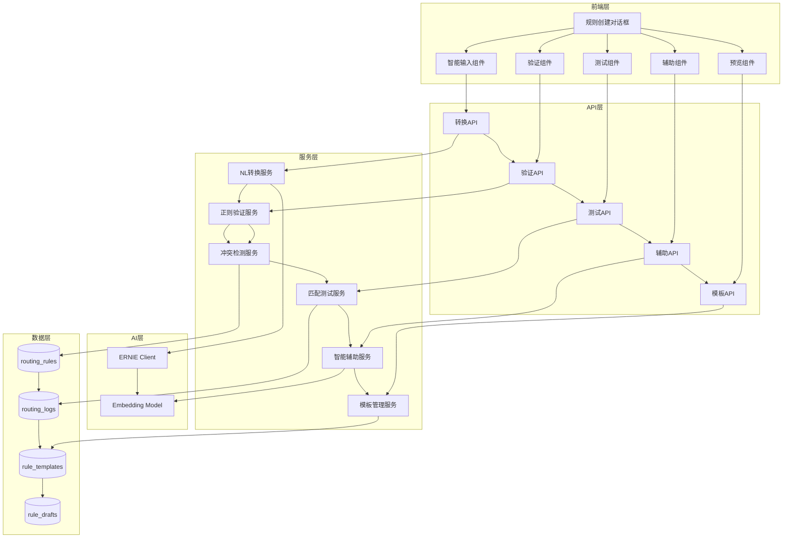
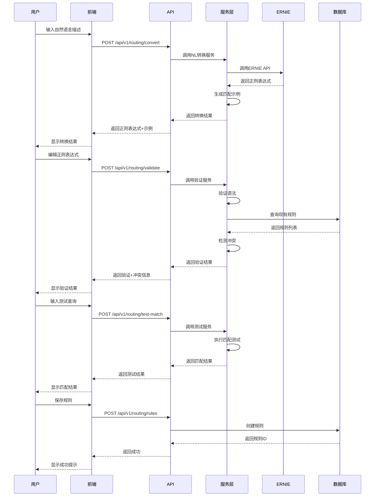

# 设计文档 - 路由规则创建智能辅助

## 概述

本文档定义了路由规则创建智能辅助功能的技术设计。该功能旨在通过智能化手段降低路由规则创建的门槛，提高规则创建的准确性和效率。

### 设计目标

1. **降低使用门槛**: 通过自然语言输入和智能转换，让不熟悉正则表达式的用户也能创建规则
2. **提高准确性**: 通过实时验证、冲突检测和测试匹配，确保规则的正确性
3. **提升效率**: 通过智能辅助、模板和自动填充，减少手动输入和重复工作
4. **增强可用性**: 通过上下文帮助、可视化和交互式教程，提供良好的用户体验

### 核心功能

- 智能输入模式切换（自然语言/正则表达式）
- 自然语言到正则表达式的AI转换
- 正则表达式实时验证和冲突检测
- 测试匹配和批量测试
- 智能字段辅助（描述生成、关键词提取、表推荐、优先级建议）
- 规则模板和快速创建
- 正则表达式可视化
- 规则预览和影响预测
- 错误恢复和草稿管理

## 架构

### 系统架构图



### 数据流



## 组件和接口

### 后端API接口

#### 1. 自然语言转换API

**端点**: `POST /api/v1/routing/convert`

**请求体**:
```json
{
  "natural_language": "查询包含IP地址的内容",
  "intent_type": "sql"
}
```

**响应体**:
```json
{
  "success": true,
  "data": {
    "regex": "\\b(?:\\d{1,3}\\.){3}\\d{1,3}\\b",
    "explanation": "匹配标准的IPv4地址格式",
    "examples": [
      "查询192.168.1.1的信息",
      "10.0.0.1的状态如何",
      "172.16.0.100有什么问题"
    ],
    "confidence": 0.95
  },
  "message": "转换成功"
}
```

#### 2. 正则表达式验证API

**端点**: `POST /api/v1/routing/validate`

**请求体**:
```json
{
  "regex": "\\b(?:\\d{1,3}\\.){3}\\d{1,3}\\b",
  "intent_type": "sql",
  "exclude_rule_id": 123
}
```

**响应体**:
```json
{
  "success": true,
  "data": {
    "is_valid": true,
    "syntax_errors": [],
    "conflicts": [
      {
        "rule_id": 456,
        "pattern": "\\d+\\.\\d+\\.\\d+\\.\\d+",
        "conflict_type": "包含关系",
        "severity": "中",
        "description": "该规则的匹配范围包含当前规则"
      }
    ],
    "complexity_score": 3.5
  },
  "message": "验证完成"
}
```

#### 3. 测试匹配API

**端点**: `POST /api/v1/routing/test-match`

**请求体**:
```json
{
  "regex": "\\b(?:\\d{1,3}\\.){3}\\d{1,3}\\b",
  "test_queries": [
    "查询192.168.1.1的信息",
    "服务器状态如何",
    "10.0.0.1有什么问题"
  ]
}
```

**响应体**:
```json
{
  "success": true,
  "data": {
    "results": [
      {
        "query": "查询192.168.1.1的信息",
        "matched": true,
        "confidence": 0.95,
        "matched_text": "192.168.1.1",
        "match_position": [2, 13]
      },
      {
        "query": "服务器状态如何",
        "matched": false,
        "confidence": 0.0
      },
      {
        "query": "10.0.0.1有什么问题",
        "matched": true,
        "confidence": 0.95,
        "matched_text": "10.0.0.1",
        "match_position": [0, 8]
      }
    ],
    "match_rate": 0.67,
    "total_count": 3,
    "matched_count": 2
  },
  "message": "测试完成"
}
```

#### 4. 关键词提取API

**端点**: `POST /api/v1/routing/extract-keywords`

**请求体**:
```json
{
  "pattern": "查询包含IP地址的内容",
  "pattern_type": "natural_language"
}
```

**响应体**:
```json
{
  "success": true,
  "data": {
    "keywords": [
      {
        "word": "IP地址",
        "weight": 0.9,
        "type": "noun"
      },
      {
        "word": "查询",
        "weight": 0.7,
        "type": "verb"
      },
      {
        "word": "内容",
        "weight": 0.5,
        "type": "noun"
      }
    ]
  },
  "message": "提取成功"
}
```

#### 5. 表推荐API

**端点**: `GET /api/v1/routing/recommend-tables`

**查询参数**:
- `keywords`: 关键词列表（逗号分隔）
- `intent_type`: 意图类型

**响应体**:
```json
{
  "success": true,
  "data": {
    "tables": [
      {
        "name": "iaas_servers",
        "category": "CMDB",
        "description": "物理服务器信息表",
        "field_count": 145,
        "relevance_score": 0.95,
        "reason": "包含IP地址、主机名等字段"
      },
      {
        "name": "mydb.bce_bcc_instances",
        "category": "监控数据",
        "description": "BCC实例监控数据",
        "field_count": 80,
        "relevance_score": 0.85,
        "reason": "包含实例IP、状态等字段"
      }
    ]
  },
  "message": "推荐成功"
}
```

#### 6. 规则模板API

**端点**: `GET /api/v1/routing/templates`

**查询参数**:
- `category`: 模板分类（可选）

**响应体**:
```json
{
  "success": true,
  "data": {
    "templates": [
      {
        "id": 1,
        "name": "IP地址查询",
        "category": "强制规则",
        "description": "匹配包含IP地址的查询",
        "pattern": "\\b(?:\\d{1,3}\\.){3}\\d{1,3}\\b",
        "intent_type": "sql",
        "priority": 95,
        "metadata": {
          "recommended_tables": ["iaas_servers", "mydb.bce_bcc_instances"],
          "keywords": ["IP", "地址"]
        }
      }
    ]
  },
  "message": "查询成功"
}
```

#### 7. 智能描述生成API

**端点**: `POST /api/v1/routing/generate-description`

**请求体**:
```json
{
  "pattern": "\\b(?:\\d{1,3}\\.){3}\\d{1,3}\\b",
  "intent_type": "sql",
  "keywords": ["IP", "地址"]
}
```

**响应体**:
```json
{
  "success": true,
  "data": {
    "description": "匹配包含IP地址的SQL查询",
    "purpose": "识别用户查询中的IP地址，路由到SQL查询处理器",
    "applicable_scenarios": [
      "查询特定IP的服务器信息",
      "查询IP地址的监控数据",
      "查询IP相关的告警记录"
    ]
  },
  "message": "生成成功"
}
```

#### 8. 优先级建议API

**端点**: `POST /api/v1/routing/suggest-priority`

**请求体**:
```json
{
  "pattern": "\\b(?:\\d{1,3}\\.){3}\\d{1,3}\\b",
  "intent_type": "sql",
  "keywords": ["IP", "地址"]
}
```

**响应体**:
```json
{
  "success": true,
  "data": {
    "suggested_priority": 95,
    "priority_range": [90, 100],
    "category": "强制规则",
    "reason": "IP地址是明确的标识符，应该具有最高优先级",
    "conflicts": []
  },
  "message": "建议成功"
}
```

#### 9. 规则影响预测API

**端点**: `POST /api/v1/routing/predict-impact`

**请求体**:
```json
{
  "pattern": "\\b(?:\\d{1,3}\\.){3}\\d{1,3}\\b",
  "intent_type": "sql"
}
```

**响应体**:
```json
{
  "success": true,
  "data": {
    "affected_query_count": 156,
    "affected_query_percentage": 12.5,
    "sample_queries": [
      "查询192.168.1.1的信息",
      "10.0.0.1的状态如何"
    ],
    "expected_accuracy_change": 0.05,
    "expected_usage_frequency": "高",
    "warning": null
  },
  "message": "预测完成"
}
```

#### 10. 草稿管理API

**端点**: `POST /api/v1/routing/drafts`

**请求体**:
```json
{
  "draft_data": {
    "pattern": "\\b(?:\\d{1,3}\\.){3}\\d{1,3}\\b",
    "intent_type": "sql",
    "priority": 95
  }
}
```

**响应体**:
```json
{
  "success": true,
  "data": {
    "draft_id": "draft_123",
    "saved_at": "2024-03-02T10:30:00Z"
  },
  "message": "草稿保存成功"
}
```

### 前端组件

#### 1. 智能输入组件 (IntelligentInput.vue)

**功能**:
- 模式切换（自然语言/正则表达式）
- 自然语言输入和转换
- 正则表达式编辑
- 实时验证提示

**Props**:
```typescript
interface Props {
  modelValue: string
  mode: 'natural' | 'regex'
  intentType: string
}
```

**Events**:
```typescript
interface Events {
  'update:modelValue': (value: string) => void
  'update:mode': (mode: 'natural' | 'regex') => void
  'convert': (result: ConvertResult) => void
  'validate': (result: ValidationResult) => void
}
```

#### 2. 验证组件 (ValidationPanel.vue)

**功能**:
- 显示验证结果
- 显示语法错误
- 显示冲突警告
- 显示复杂度评分

**Props**:
```typescript
interface Props {
  validationResult: ValidationResult
  showDetails: boolean
}
```

#### 3. 测试组件 (TestMatchPanel.vue)

**功能**:
- 测试查询输入
- 批量测试
- 显示匹配结果
- 高亮匹配文本
- 统计匹配率

**Props**:
```typescript
interface Props {
  regex: string
  testQueries: string[]
}
```

**Events**:
```typescript
interface Events {
  'test': (results: TestResult[]) => void
  'save-test-case': (queries: string[]) => void
}
```

#### 4. 辅助组件 (AssistantPanel.vue)

**功能**:
- 描述生成
- 关键词提取和编辑
- 表推荐和选择
- 优先级建议

**Props**:
```typescript
interface Props {
  pattern: string
  intentType: string
  keywords: Keyword[]
  recommendedTables: Table[]
  suggestedPriority: number
}
```

#### 5. 模板选择器 (TemplateSelector.vue)

**功能**:
- 显示模板列表
- 模板搜索和过滤
- 模板预览
- 应用模板

**Props**:
```typescript
interface Props {
  templates: Template[]
  category: string
}
```

**Events**:
```typescript
interface Events {
  'apply': (template: Template) => void
}
```

#### 6. 可视化组件 (RegexVisualizer.vue)

**功能**:
- 显示正则表达式铁路图
- 高亮正则元素
- 交互式点击
- 复杂度评分

**Props**:
```typescript
interface Props {
  regex: string
}
```

#### 7. 预览组件 (RulePreview.vue)

**功能**:
- 显示规则完整信息
- 显示测试结果摘要
- 显示冲突警告
- 显示影响预测

**Props**:
```typescript
interface Props {
  rule: RuleData
  testResults: TestResult[]
  conflicts: Conflict[]
  impact: ImpactPrediction
}
```

## 数据模型

### 数据库表

#### 1. rule_templates (规则模板表)

```sql
CREATE TABLE rule_templates (
    id INT PRIMARY KEY AUTO_INCREMENT,
    name VARCHAR(100) NOT NULL COMMENT '模板名称',
    category VARCHAR(50) NOT NULL COMMENT '模板分类',
    description TEXT COMMENT '模板描述',
    pattern VARCHAR(500) NOT NULL COMMENT '匹配模式',
    intent_type VARCHAR(50) NOT NULL COMMENT '意图类型',
    priority INT NOT NULL DEFAULT 50 COMMENT '优先级',
    metadata JSON COMMENT '元数据',
    is_system BOOLEAN DEFAULT TRUE COMMENT '是否系统模板',
    created_by VARCHAR(50) COMMENT '创建者',
    created_at TIMESTAMP DEFAULT CURRENT_TIMESTAMP,
    updated_at TIMESTAMP DEFAULT CURRENT_TIMESTAMP ON UPDATE CURRENT_TIMESTAMP,
    INDEX idx_category (category),
    INDEX idx_intent_type (intent_type)
) ENGINE=InnoDB DEFAULT CHARSET=utf8mb4 COMMENT='路由规则模板表';
```

#### 2. rule_drafts (规则草稿表)

```sql
CREATE TABLE rule_drafts (
    id INT PRIMARY KEY AUTO_INCREMENT,
    user_id VARCHAR(50) NOT NULL COMMENT '用户ID',
    draft_data JSON NOT NULL COMMENT '草稿数据',
    created_at TIMESTAMP DEFAULT CURRENT_TIMESTAMP,
    updated_at TIMESTAMP DEFAULT CURRENT_TIMESTAMP ON UPDATE CURRENT_TIMESTAMP,
    INDEX idx_user_id (user_id),
    INDEX idx_updated_at (updated_at)
) ENGINE=InnoDB DEFAULT CHARSET=utf8mb4 COMMENT='路由规则草稿表';
```

### TypeScript接口

```typescript
// 转换结果
interface ConvertResult {
  regex: string
  explanation: string
  examples: string[]
  confidence: number
}

// 验证结果
interface ValidationResult {
  is_valid: boolean
  syntax_errors: SyntaxError[]
  conflicts: Conflict[]
  complexity_score: number
}

// 语法错误
interface SyntaxError {
  message: string
  position: number
  suggestion: string
}

// 冲突信息
interface Conflict {
  rule_id: number
  pattern: string
  conflict_type: string
  severity: 'high' | 'medium' | 'low'
  description: string
}

// 测试结果
interface TestResult {
  query: string
  matched: boolean
  confidence: number
  matched_text?: string
  match_position?: [number, number]
}

// 关键词
interface Keyword {
  word: string
  weight: number
  type: 'noun' | 'verb' | 'adjective'
}

// 表推荐
interface Table {
  name: string
  category: 'CMDB' | '监控数据'
  description: string
  field_count: number
  relevance_score: number
  reason: string
}

// 规则模板
interface Template {
  id: number
  name: string
  category: string
  description: string
  pattern: string
  intent_type: string
  priority: number
  metadata: {
    recommended_tables?: string[]
    keywords?: string[]
  }
}

// 影响预测
interface ImpactPrediction {
  affected_query_count: number
  affected_query_percentage: number
  sample_queries: string[]
  expected_accuracy_change: number
  expected_usage_frequency: string
  warning: string | null
}

// 规则数据
interface RuleData {
  pattern: string
  intent_type: string
  priority: number
  description: string
  metadata: {
    recommended_tables?: string[]
    keywords?: string[]
  }
}
```


## 正确性属性

*属性是一个特征或行为，应该在系统的所有有效执行中保持为真——本质上是关于系统应该做什么的形式化陈述。属性作为人类可读规范和机器可验证正确性保证之间的桥梁。*

### 属性反思

在编写正确性属性之前，我们需要识别并消除冗余属性：

**冗余分析**:

1. **模式切换相关**: 需求1.3（保留内容）和18.1（自动保存）可以合并为一个更全面的状态保持属性
2. **验证相关**: 需求3.1（实时验证）、3.2（错误信息）、3.3（成功提示）可以合并为一个验证完整性属性
3. **测试相关**: 需求4.2（实时匹配）、4.5（批量测试）、4.6（显示结果）可以合并为一个测试完整性属性
4. **智能辅助相关**: 需求5.1（描述生成）、6.1（关键词提取）、13.1（优先级建议）都是自动生成功能，可以合并为一个智能辅助属性
5. **冲突检测相关**: 需求3.4（检测冲突）、10.1-10.4（各种冲突类型）可以合并为一个冲突检测属性
6. **性能相关**: 需求19.1-19.3（响应时间）可以合并为一个性能属性

**保留的独立属性**:
- 自然语言转换（需求2.1-2.3）
- 正则表达式验证（需求3.1-3.3）
- 测试匹配（需求4.2-4.6）
- 关键词提取（需求6.2-6.3）
- 表推荐（需求7.2-7.3）
- 冲突检测（需求10.1-10.5）
- 批量测试（需求11.2-11.5）
- 复杂度评分（需求12.6）
- 优先级建议（需求13.1-13.5）
- 规则预览（需求14.2-14.6）
- 自然语言理解（需求15.1-15.4）
- 影响预测（需求16.1-16.5）
- 状态保持（需求1.3+18.1）
- 防抖优化（需求3.6+19.4）
- 性能要求（需求19.1-19.3）
- 可访问性（需求20.1-20.6）

### 属性 1: 自然语言转换完整性

*对于任意*自然语言描述和意图类型，调用转换API应该返回包含正则表达式、解释说明和至少3个匹配示例的完整结果。

**验证需求**: 2.1, 2.2, 2.3

### 属性 2: 转换响应时间

*对于任意*自然语言描述，ERNIE API调用应该在5秒内返回转换结果。

**验证需求**: 2.7

### 属性 3: 正则表达式验证完整性

*对于任意*正则表达式输入，验证API应该返回包含语法正确性、错误信息（如果有）和冲突检测结果的完整验证结果。

**验证需求**: 3.1, 3.2, 3.3

### 属性 4: 验证防抖机制

*对于任意*连续的输入事件序列，验证请求应该在用户停止输入500毫秒后才执行，避免频繁的API调用。

**验证需求**: 3.6, 19.4

### 属性 5: 冲突检测完整性

*对于任意*匹配模式，冲突检测应该识别所有类型的冲突（完全相同、语义相似、包含关系），并为每个冲突提供严重程度和详细描述。

**验证需求**: 3.4, 3.5, 10.1, 10.2, 10.3, 10.4, 10.5, 10.6

### 属性 6: 测试匹配完整性

*对于任意*正则表达式和测试查询列表，测试API应该为每个查询返回匹配结果，包括是否匹配、置信度、匹配文本和位置。

**验证需求**: 4.2, 4.3, 4.5, 4.6

### 属性 7: 批量测试统计准确性

*对于任意*测试查询列表和匹配结果，匹配成功率应该等于匹配查询数量除以总查询数量。

**验证需求**: 11.2, 11.4, 11.5

### 属性 8: 智能描述生成

*对于任意*匹配模式和意图类型，描述生成API应该返回包含规则目的和适用场景的描述文本。

**验证需求**: 5.1, 5.2, 5.5

### 属性 9: 描述响应式更新

*对于任意*已生成的描述，当意图类型改变时，描述应该相应更新以反映新的意图类型。

**验证需求**: 5.4

### 属性 10: 关键词提取完整性

*对于任意*自然语言描述，关键词提取应该识别所有名词和动词，并为每个关键词分配权重。

**验证需求**: 6.1, 6.2, 6.4, 6.6

### 属性 11: 正则字面量提取

*对于任意*正则表达式，关键词提取应该识别所有字面量文本（非元字符）作为关键词。

**验证需求**: 6.3

### 属性 12: 表推荐相关性

*对于任意*关键词列表和SQL意图类型，表推荐API应该返回相关表列表，每个表包含名称、分类、描述、字段数量和相关性评分。

**验证需求**: 7.2, 7.3, 7.6

### 属性 13: 表推荐搜索过滤

*对于任意*搜索词和表列表，过滤后的表列表应该只包含名称或描述中包含搜索词的表。

**验证需求**: 7.4

### 属性 14: 模板应用完整性

*对于任意*规则模板，应用模板应该自动填充所有字段（pattern、intent_type、priority、metadata），并且填充后的值应该与模板定义一致。

**验证需求**: 8.3, 8.4

### 属性 15: 正则复杂度评分

*对于任意*正则表达式，复杂度评分应该基于正则元素的数量和嵌套深度计算，返回0-10之间的数值。

**验证需求**: 12.6

### 属性 16: 优先级建议准确性

*对于任意*匹配模式和意图类型，优先级建议应该根据规则类型返回合理的优先级范围：强制规则（90-100）、业务规则（50-89）、通用规则（1-49）。

**验证需求**: 13.1, 13.2, 13.3, 13.4, 13.5

### 属性 17: 优先级冲突检测

*对于任意*建议的优先级，如果存在相同优先级的规则，应该检测到冲突并提供调整建议。

**验证需求**: 13.7

### 属性 18: 规则预览完整性

*对于任意*规则数据，预览应该显示所有字段的值、生成的正则表达式（如果使用自然语言模式）、推荐的表和关键词、测试结果摘要和潜在冲突警告。

**验证需求**: 14.2, 14.3, 14.4, 14.5, 14.6

### 属性 19: 自然语言模式理解

*对于任意*包含"包含"、"以...开头"、"以...结尾"、"或"、"且"等模式的自然语言描述，转换API应该正确理解并生成对应的正则表达式。

**验证需求**: 15.1, 15.2, 15.3

### 属性 20: 数量词理解

*对于任意*包含"多个"、"至少"、"最多"等数量词的自然语言描述，转换API应该正确理解并生成对应的正则量词（+、*、{n,}、{,n}）。

**验证需求**: 15.4

### 属性 21: 多语言支持

*对于任意*包含中文和英文混合的自然语言描述，转换API应该正确解析并生成正则表达式。

**验证需求**: 15.7

### 属性 22: 影响预测准确性

*对于任意*匹配模式，影响预测应该基于历史查询数据计算受影响的查询数量、百分比和预期准确率变化。

**验证需求**: 16.1, 16.2, 16.3, 16.4, 16.5

### 属性 23: 状态保持一致性

*对于任意*用户输入状态，在模式切换、对话框关闭或自动保存时，所有已输入的内容应该被保留并可恢复。

**验证需求**: 1.3, 18.1, 18.2

### 属性 24: 草稿管理完整性

*对于任意*草稿数据，草稿列表应该显示所有草稿的保存时间，并支持恢复和删除操作。

**验证需求**: 18.5, 18.6

### 属性 25: 响应时间性能

*对于任意*用户输入、验证请求或API调用，系统应该在规定时间内响应：用户输入（100ms）、验证（500ms）、ERNIE API（5s）。

**验证需求**: 19.1, 19.2, 19.3

### 属性 26: 缓存命中率

*对于任意*重复的表列表或模板查询，第二次及后续查询应该从缓存中获取数据，响应时间应该显著减少。

**验证需求**: 19.5

### 属性 27: 键盘导航完整性

*对于任意*表单字段序列，使用Tab键应该能够按顺序在所有字段间切换，使用Enter键应该能够提交表单，使用Escape键应该能够关闭对话框。

**验证需求**: 20.1, 20.3, 20.4, 20.5

### 属性 28: ARIA标签完整性

*对于任意*交互元素，应该提供适当的ARIA标签和状态通知，以支持屏幕阅读器。

**验证需求**: 20.2, 20.6

## 错误处理

### 错误类型

#### 1. API错误

**ERNIE API调用失败**:
- 错误码: `ERNIE_API_ERROR`
- 处理: 显示错误提示，建议用户切换到正则表达式模式或稍后重试
- 降级: 提供基本的模式识别（如IP地址、实例ID）

**验证API超时**:
- 错误码: `VALIDATION_TIMEOUT`
- 处理: 显示超时提示，允许用户继续编辑或重新验证
- 降级: 仅进行基本的语法检查

**表推荐API失败**:
- 错误码: `TABLE_RECOMMENDATION_ERROR`
- 处理: 显示错误提示，允许用户手动输入表名
- 降级: 显示常用表列表

#### 2. 验证错误

**正则表达式语法错误**:
- 错误码: `REGEX_SYNTAX_ERROR`
- 处理: 高亮错误位置，显示具体错误信息和修复建议
- 示例: "未闭合的括号，位置：第15个字符"

**规则冲突**:
- 错误码: `RULE_CONFLICT`
- 处理: 显示冲突规则列表，提供覆盖、合并或取消选项
- 示例: "该规则与规则#456冲突（包含关系）"

**优先级冲突**:
- 错误码: `PRIORITY_CONFLICT`
- 处理: 显示冲突的优先级，建议调整优先级
- 示例: "优先级95已被规则#123使用，建议使用94或96"

#### 3. 输入错误

**空输入**:
- 错误码: `EMPTY_INPUT`
- 处理: 显示提示信息，禁用保存按钮
- 示例: "请输入匹配模式"

**无效的正则表达式**:
- 错误码: `INVALID_REGEX`
- 处理: 显示验证错误，提供修复建议
- 示例: "正则表达式无效，请检查语法"

**测试查询为空**:
- 错误码: `EMPTY_TEST_QUERIES`
- 处理: 显示提示信息，禁用测试按钮
- 示例: "请输入至少一个测试查询"

#### 4. 数据错误

**草稿加载失败**:
- 错误码: `DRAFT_LOAD_ERROR`
- 处理: 显示错误提示，允许用户重新开始或重试
- 降级: 清空表单，从头开始

**模板加载失败**:
- 错误码: `TEMPLATE_LOAD_ERROR`
- 处理: 显示错误提示，允许用户手动输入
- 降级: 隐藏模板选择器

**历史数据查询失败**:
- 错误码: `HISTORY_QUERY_ERROR`
- 处理: 显示错误提示，影响预测功能不可用
- 降级: 隐藏影响预测面板

### 错误处理策略

#### 1. 用户友好的错误消息

```typescript
const errorMessages = {
  ERNIE_API_ERROR: {
    title: '转换失败',
    message: 'AI服务暂时不可用，请切换到正则表达式模式或稍后重试',
    action: '切换模式'
  },
  REGEX_SYNTAX_ERROR: {
    title: '语法错误',
    message: '正则表达式语法有误，请检查并修正',
    action: '查看帮助'
  },
  RULE_CONFLICT: {
    title: '规则冲突',
    message: '该规则与现有规则冲突，请调整或选择处理方式',
    action: '查看冲突'
  }
}
```

#### 2. 错误恢复机制

**自动重试**:
- API调用失败时，自动重试最多3次
- 重试间隔：1秒、2秒、4秒（指数退避）

**降级处理**:
- ERNIE API不可用时，使用基本的模式识别
- 表推荐失败时，显示常用表列表
- 影响预测失败时，隐藏预测面板

**状态保存**:
- 发生错误时，自动保存当前输入到草稿
- 用户可以从草稿恢复，避免数据丢失

#### 3. 错误日志

```typescript
interface ErrorLog {
  timestamp: string
  error_code: string
  error_message: string
  user_id: string
  context: {
    pattern?: string
    intent_type?: string
    action: string
  }
  stack_trace?: string
}
```

**日志记录**:
- 所有错误都记录到后端日志
- 包含用户ID、错误上下文和堆栈跟踪
- 用于错误分析和系统改进

## 测试策略

### 测试方法

#### 1. 单元测试

**后端服务测试**:
- 测试每个API端点的输入验证
- 测试错误处理和边界条件
- 测试数据库操作的正确性

**前端组件测试**:
- 测试组件的渲染和交互
- 测试Props和Events的传递
- 测试状态管理的正确性

**示例**:
```python
# 测试自然语言转换API
def test_convert_natural_language():
    # 测试正常情况
    result = convert_api.convert("查询包含IP地址的内容", "sql")
    assert result["success"] is True
    assert "regex" in result["data"]
    assert len(result["data"]["examples"]) >= 3
    
    # 测试空输入
    result = convert_api.convert("", "sql")
    assert result["success"] is False
    assert result["error"] == "EMPTY_INPUT"
    
    # 测试无效意图类型
    result = convert_api.convert("查询内容", "invalid")
    assert result["success"] is False
    assert result["error"] == "INVALID_INTENT_TYPE"
```

#### 2. 属性测试

**测试配置**:
- 使用pytest-hypothesis进行属性测试
- 每个属性测试运行100次迭代
- 生成随机输入数据进行测试

**标签格式**:
```python
# Feature: routing-rule-intelligent-assistant, Property 1: 自然语言转换完整性
@given(
    natural_language=st.text(min_size=1, max_size=200),
    intent_type=st.sampled_from(["sql", "rag_knowledge", "rag_report", "chat"])
)
def test_convert_completeness(natural_language, intent_type):
    """
    对于任意自然语言描述和意图类型，
    调用转换API应该返回包含正则表达式、解释说明和至少3个匹配示例的完整结果。
    """
    result = convert_api.convert(natural_language, intent_type)
    
    assert result["success"] is True
    assert "regex" in result["data"]
    assert "explanation" in result["data"]
    assert "examples" in result["data"]
    assert len(result["data"]["examples"]) >= 3
    assert "confidence" in result["data"]
```

**属性测试覆盖**:
- 属性1-28：每个属性都有对应的属性测试
- 使用随机生成的输入数据
- 验证输出的完整性和正确性

#### 3. 集成测试

**端到端测试**:
- 测试完整的规则创建流程
- 测试前后端交互
- 测试数据库操作

**示例场景**:
```typescript
describe('规则创建流程', () => {
  it('应该完成完整的规则创建流程', async () => {
    // 1. 打开创建对话框
    await openCreateDialog()
    
    // 2. 输入自然语言描述
    await inputNaturalLanguage('查询包含IP地址的内容')
    
    // 3. 等待转换完成
    await waitForConversion()
    expect(getRegex()).toMatch(/\\b(?:\\d{1,3}\\.){3}\\d{1,3}\\b/)
    
    // 4. 验证正则表达式
    await validateRegex()
    expect(getValidationResult().is_valid).toBe(true)
    
    // 5. 测试匹配
    await inputTestQuery('查询192.168.1.1的信息')
    await testMatch()
    expect(getTestResult().matched).toBe(true)
    
    // 6. 选择意图类型
    await selectIntentType('sql')
    
    // 7. 选择推荐表
    await selectRecommendedTable('iaas_servers')
    
    // 8. 预览规则
    await previewRule()
    expect(getPreview()).toContain('iaas_servers')
    
    // 9. 保存规则
    await saveRule()
    expect(getSuccessMessage()).toContain('规则创建成功')
  })
})
```

#### 4. 性能测试

**响应时间测试**:
- 测试用户输入响应时间（< 100ms）
- 测试验证响应时间（< 500ms）
- 测试ERNIE API响应时间（< 5s）

**负载测试**:
- 测试并发用户创建规则
- 测试大量规则的冲突检测
- 测试批量测试的性能

**示例**:
```python
# Feature: routing-rule-intelligent-assistant, Property 25: 响应时间性能
def test_response_time_performance():
    """
    对于任意用户输入、验证请求或API调用，
    系统应该在规定时间内响应。
    """
    # 测试用户输入响应时间
    start = time.time()
    response = input_handler.handle_input("test input")
    elapsed = time.time() - start
    assert elapsed < 0.1  # 100ms
    
    # 测试验证响应时间
    start = time.time()
    response = validate_api.validate("\\d+")
    elapsed = time.time() - start
    assert elapsed < 0.5  # 500ms
    
    # 测试ERNIE API响应时间
    start = time.time()
    response = convert_api.convert("查询内容", "sql")
    elapsed = time.time() - start
    assert elapsed < 5.0  # 5s
```

#### 5. 可访问性测试

**自动化测试**:
- 使用axe-core进行可访问性扫描
- 检查ARIA标签的完整性
- 检查键盘导航的可用性

**手动测试**:
- 使用屏幕阅读器测试
- 使用仅键盘操作测试
- 检查颜色对比度

**示例**:
```typescript
describe('可访问性测试', () => {
  it('应该支持完整的键盘导航', async () => {
    await openCreateDialog()
    
    // 测试Tab键导航
    await pressTab()
    expect(getFocusedElement()).toBe('pattern-input')
    
    await pressTab()
    expect(getFocusedElement()).toBe('intent-type-select')
    
    await pressTab()
    expect(getFocusedElement()).toBe('priority-input')
    
    // 测试Enter键提交
    await pressEnter()
    expect(isFormSubmitted()).toBe(true)
    
    // 测试Escape键关闭
    await openCreateDialog()
    await pressEscape()
    expect(isDialogClosed()).toBe(true)
  })
  
  it('应该提供完整的ARIA标签', async () => {
    await openCreateDialog()
    
    const patternInput = getElement('pattern-input')
    expect(patternInput.getAttribute('aria-label')).toBeTruthy()
    expect(patternInput.getAttribute('aria-describedby')).toBeTruthy()
    
    const intentSelect = getElement('intent-type-select')
    expect(intentSelect.getAttribute('aria-label')).toBeTruthy()
    
    const saveButton = getElement('save-button')
    expect(saveButton.getAttribute('aria-label')).toBeTruthy()
  })
})
```

### 测试覆盖率目标

- 单元测试覆盖率：> 80%
- 属性测试覆盖率：100%（所有28个属性）
- 集成测试覆盖率：> 70%
- 性能测试覆盖率：100%（所有性能要求）
- 可访问性测试覆盖率：100%（所有可访问性要求）

### 测试工具

**后端**:
- pytest：单元测试框架
- pytest-hypothesis：属性测试框架
- pytest-asyncio：异步测试支持
- pytest-cov：代码覆盖率工具

**前端**:
- Vitest：单元测试框架
- @testing-library/vue：组件测试工具
- @axe-core/vue：可访问性测试工具
- fast-check：属性测试框架

**性能测试**:
- locust：负载测试工具
- pytest-benchmark：性能基准测试

**集成测试**:
- Playwright：端到端测试框架
- Cypress：备选端到端测试框架

