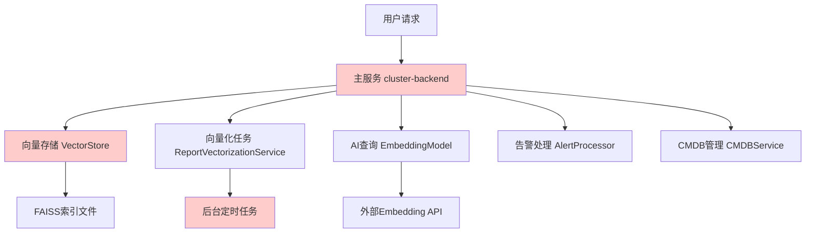
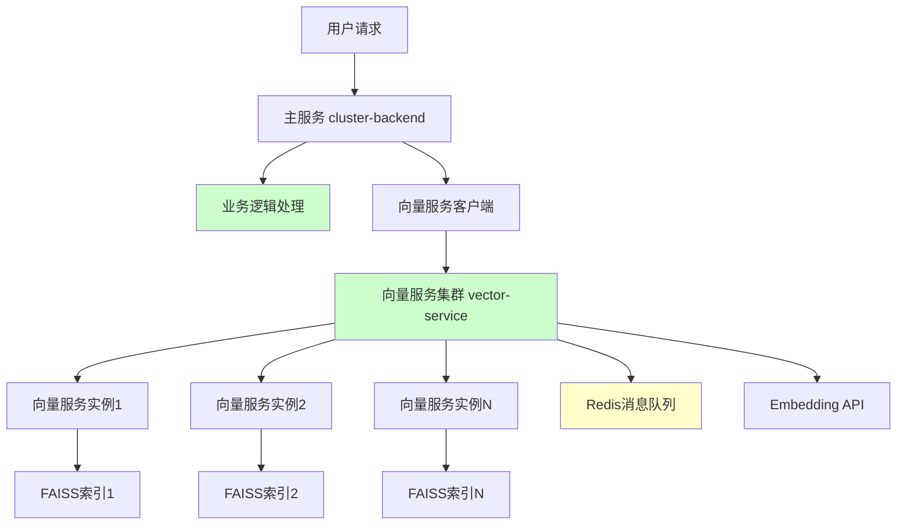

# 设计文档: 向量数据库微服务化改造

## 概述

本设计文档描述了集群管理平台向量数据库模块的微服务化改造方案。当前向量数据库模块与主业务服务耦合，导致性能影响和资源竞争问题。通过实施微服务化架构，将向量存储、向量化任务、检索功能独立部署，实现性能隔离、高可用性和弹性扩展。

**重要说明**：本项目尚未上生产环境，因此采用直接拆分策略，无需考虑流量切换和向后兼容问题。

改造目标包括：CPU使用率降低30-50%，内存减少1-2GB，响应时间提升20-40%，并发能力提升50-100%。

## 架构设计

### 当前架构问题分析



**问题识别**：
- 向量化任务每5分钟全量扫描，占用主线程资源
- FAISS索引常驻内存，启动时加载较慢
- 向量检索与业务逻辑竞争CPU/内存资源
- 单点故障风险，向量服务异常影响整体系统

### 目标微服务架构



## 模块拆分策略

### 需要拆分的模块

| 模块 | 当前位置 | 拆分后位置 | 说明 |
|------|----------|------------|------|
| **VectorStore** | `app/services/ai/vector_store.py` | `vector-service/` | FAISS向量存储和检索 |
| **ReportVectorizationService** | `app/services/ai/report_vectorization_service.py` | `vector-service/` | 报告向量化任务 |
| **EmbeddingModel** | `app/services/ai/embedding_model.py` | `vector-service/` | Embedding模型调用 |
| **SchemaVectorStore** | `app/services/ai/schema_vector_store.py` | `vector-service/` | Schema向量存储 |

### 保留在主服务的模块

| 模块 | 说明 |
|------|------|
| **ERNIEClient** | AI对话客户端，业务核心 |
| **IntentRouter** | 意图路由，业务核心逻辑 |
| **QueryExecutor** | 查询执行器，依赖业务数据库 |
| **AlertProcessor** | 告警处理，核心业务 |
| **VectorServiceClient** | 新增：向量服务HTTP客户端 |

## 实施步骤

### Step 1: 创建向量服务（Week 1）

**目录结构**：
```
vector-service/
├── app/
│   ├── __init__.py
│   ├── main.py              # FastAPI 入口
│   ├── api/
│   │   ├── __init__.py
│   │   └── vectors.py       # 向量 API 路由
│   ├── core/
│   │   ├── __init__.py
│   │   ├── config.py        # 服务配置
│   │   └── logger.py        # 日志配置
│   └── services/
│       ├── __init__.py
│       ├── vector_store.py  # 从原项目迁移
│       ├── embedding.py     # 从原项目迁移
│       └── queue.py         # 任务队列处理
├── Dockerfile
├── requirements.txt
└── start.sh
```

**向量服务 API 设计**：

```python
# vector-service/app/api/vectors.py

from fastapi import APIRouter, HTTPException
from pydantic import BaseModel
from typing import List, Dict, Any, Optional
import numpy as np

router = APIRouter()

class VectorSearchRequest(BaseModel):
    query_vector: List[float]
    top_k: int = 10
    threshold: float = 0.0
    filters: Optional[Dict[str, Any]] = None

class VectorSearchResponse(BaseModel):
    success: bool
    data: List[Dict[str, Any]]
    total: int
    latency_ms: float

class VectorAddRequest(BaseModel):
    entry_id: int
    vector: List[float]
    metadata: Dict[str, Any]

@router.post("/search", response_model=VectorSearchResponse)
async def search_vectors(request: VectorSearchRequest):
    """向量检索"""
    from app.services.vector_store import get_vector_store
    
    store = get_vector_store()
    results = store.search(
        query_embedding=np.array(request.query_vector),
        top_k=request.top_k,
        similarity_threshold=request.threshold
    )
    
    return VectorSearchResponse(
        success=True,
        data=results,
        total=len(results),
        latency_ms=0.0
    )

@router.post("/")
async def add_vector(request: VectorAddRequest):
    """添加向量"""
    from app.services.vector_store import get_vector_store
    
    store = get_vector_store()
    success = store.add(
        entry_id=request.entry_id,
        embedding=np.array(request.vector),
        metadata=request.metadata
    )
    
    return {"success": success}

@router.get("/health")
async def health_check():
    """健康检查"""
    from app.services.vector_store import get_vector_store
    
    store = get_vector_store()
    return store.health_check()
```

### Step 2: 主服务接入向量服务（Week 2）

**创建向量服务客户端**：

```python
# backend/app/services/ai/vector_client.py

import httpx
import numpy as np
from typing import List, Dict, Any, Optional
from app.core.config import settings

class VectorServiceClient:
    """向量服务 HTTP 客户端"""
    
    def __init__(self):
        self.base_url = settings.VECTOR_SERVICE_URL
        self.client = httpx.AsyncClient(timeout=30.0)
    
    async def search(
        self,
        query_embedding: np.ndarray,
        top_k: int = 5,
        similarity_threshold: float = 0.0,
        filters: Optional[Dict[str, Any]] = None
    ) -> List[Dict[str, Any]]:
        """向量检索"""
        response = await self.client.post(
            f"{self.base_url}/api/v1/vectors/search",
            json={
                "query_vector": query_embedding.tolist(),
                "top_k": top_k,
                "threshold": similarity_threshold,
                "filters": filters
            }
        )
        response.raise_for_status()
        result = response.json()
        return result["data"]
    
    async def add(
        self,
        entry_id: int,
        embedding: np.ndarray,
        metadata: Dict[str, Any]
    ) -> bool:
        """添加向量"""
        response = await self.client.post(
            f"{self.base_url}/api/v1/vectors/",
            json={
                "entry_id": entry_id,
                "vector": embedding.tolist(),
                "metadata": metadata
            }
        )
        response.raise_for_status()
        return response.json()["success"]
    
    async def health_check(self) -> Dict[str, Any]:
        """健康检查"""
        response = await self.client.get(f"{self.base_url}/health")
        return response.json()

# 单例模式
_vector_client: Optional[VectorServiceClient] = None

def get_vector_client() -> VectorServiceClient:
    global _vector_client
    if _vector_client is None:
        _vector_client = VectorServiceClient()
    return _vector_client
```

**修改原调用代码**：

```python
# backend/app/services/ai/report_retriever.py

class ReportRetriever:
    async def retrieve_similar_reports(
        self,
        query: str,
        top_k: int = 5,
        similarity_threshold: float = 0.6
    ) -> List[Dict[str, Any]]:
        # 生成查询向量
        query_embedding = await self.embedding_model.encode(query)
        
        # 调用向量服务（替代原来的本地调用）
        from app.services.ai.vector_client import get_vector_client
        client = get_vector_client()
        
        results = await client.search(
            query_embedding=query_embedding,
            top_k=top_k,
            similarity_threshold=similarity_threshold,
            filters={"type": "report"}
        )
        
        return results
```

### Step 3: 向量化任务迁移（Week 3）

**向量服务任务队列**：

```python
# vector-service/app/services/queue.py

import asyncio
import json
from typing import Dict, Any
from datetime import datetime
import redis.asyncio as redis

class VectorizationQueue:
    """向量化任务队列"""
    
    def __init__(self):
        self.redis = redis.from_url("redis://redis:6379")
        self.queue_key = "vector_tasks"
    
    async def enqueue(self, task: Dict[str, Any]):
        """添加任务到队列"""
        task["created_at"] = datetime.utcnow().isoformat()
        await self.redis.lpush(self.queue_key, json.dumps(task))
    
    async def dequeue(self, timeout: int = 5) -> Optional[Dict[str, Any]]:
        """从队列获取任务"""
        result = await self.redis.brpop(self.queue_key, timeout=timeout)
        if result:
            return json.loads(result[1])
        return None
    
    async def process_tasks(self):
        """处理任务循环"""
        from app.services.vector_store import get_vector_store
        from app.services.embedding import get_embedding_service
        
        store = get_vector_store()
        embedder = get_embedding_service()
        
        while True:
            task = await self.dequeue()
            if not task:
                await asyncio.sleep(1)
                continue
            
            try:
                # 向量化文本
                vector = await embedder.encode(task["text_content"])
                
                # 存储向量
                await store.add(
                    entry_id=task["entry_id"],
                    embedding=vector,
                    metadata=task.get("metadata", {})
                )
                
                print(f"✅ 任务处理完成: {task['task_id']}")
                
            except Exception as e:
                print(f"❌ 任务处理失败: {task['task_id']}, 错误: {e}")
```

**主服务提交任务**：

```python
# backend/app/services/ai/report_vectorization_service.py

async def vectorize_report(self, task_id: str, report_type: str, file_path: str):
    """向量化报告 - 改为提交任务到队列"""
    
    # 下载报告内容
    content = await self._download_report_from_minio(file_path)
    
    # 提取内容层级
    content_layers = self._extract_content_layers(content, report_type)
    
    # 提交到向量服务队列
    import httpx
    async with httpx.AsyncClient() as client:
        response = await client.post(
            f"{settings.VECTOR_SERVICE_URL}/api/v1/tasks/vectorize",
            json={
                "task_id": task_id,
                "text_content": f"{content_layers['summary']}\n\n{content_layers['conclusion']}",
                "metadata": {
                    "task_id": task_id,
                    "report_type": report_type,
                    "file_path": file_path
                }
            }
        )
    
    return response.json()["success"]
```

### Step 4: 部署配置（Week 4）

**docker-compose.yml**：

```yaml
version: '3.8'

services:
  # 主服务
  backend:
    build: ./backend
    ports:
      - "8000:8000"
    environment:
      - VECTOR_SERVICE_URL=http://vector-service:8000
      - REDIS_URL=redis://redis:6379
    depends_on:
      - mysql
      - redis
      - vector-service

  # 向量服务
  vector-service:
    build: ./vector-service
    ports:
      - "8001:8000"
    environment:
      - REDIS_URL=redis://redis:6379
      - VECTOR_DIMENSION=768
      - INDEX_PATH=/app/vector_store
    volumes:
      - vector_store:/app/vector_store
    deploy:
      replicas: 2

  # 基础服务
  mysql:
    image: mysql:8.0
    # ... 配置

  redis:
    image: redis:7-alpine
    # ... 配置

volumes:
  vector_store:
```

## 简化实施路线图

| 周次 | 任务 | 产出物 |
|------|------|--------|
| **Week 1** | 创建向量服务基础框架 | `vector-service/` 目录，基础 API |
| **Week 2** | 迁移 VectorStore 和 Embedding | 向量存储服务可用 |
| **Week 3** | 迁移向量化任务队列 | 异步任务处理可用 |
| **Week 4** | 主服务接入 + 部署配置 | 完整微服务架构运行 |
| **Week 5** | 测试和优化 | 性能测试报告 |
| **Week 6** | 文档和清理 | 删除旧代码，更新文档 |

## 代码修改清单

### 需要修改的文件

| 文件 | 修改内容 |
|------|----------|
| `backend/app/services/ai/report_retriever.py` | 使用 VectorServiceClient 替代本地 VectorStore |
| `backend/app/services/ai/schema_vector_store.py` | 使用 VectorServiceClient 替代本地 VectorStore |
| `backend/app/services/ai/report_vectorization_service.py` | 提交任务到向量服务队列 |
| `backend/main.py` | 移除向量存储初始化代码 |
| `backend/requirements.txt` | 移除 faiss-cpu（移到向量服务） |

### 新增文件

| 文件 | 说明 |
|------|------|
| `backend/app/services/ai/vector_client.py` | 向量服务 HTTP 客户端 |
| `vector-service/app/main.py` | 向量服务 FastAPI 入口 |
| `vector-service/app/api/vectors.py` | 向量服务 API 路由 |
| `vector-service/app/services/vector_store.py` | 迁移后的向量存储 |
| `vector-service/app/services/queue.py` | 任务队列处理 |

### 需要删除的文件（迁移到向量服务）

| 文件 | 迁移目标 |
|------|----------|
| `backend/app/services/ai/vector_store.py` | `vector-service/app/services/vector_store.py` |
| `backend/app/services/ai/embedding_model.py` | `vector-service/app/services/embedding.py` |
| `backend/app/services/ai/schema_vector_store.py` | `vector-service/app/services/schema_store.py` |

## 关键设计决策

### 为什么使用 HTTP 而不是 gRPC？

- **简单性**：HTTP + JSON 易于调试和测试
- **兼容性**：FastAPI 原生支持，无需额外依赖
- **性能足够**：向量检索不是高频操作，HTTP 性能足够

### 为什么使用 Redis 队列而不是消息队列？

- **简化部署**：无需额外部署 RabbitMQ/Kafka
- **可靠性**：Redis 已在项目中使用
- **轻量级**：任务量不大，Redis 足够

### 为什么初期不使用 Nacos？

- **项目未上生产**：服务实例固定，无需动态发现
- **简化架构**：使用 Docker Compose 的服务发现足够
- **后期扩展**：需要动态扩容时再引入 Nacos

## 性能目标

| 指标 | 当前 | 目标 | 提升 |
|------|------|------|------|
| CPU使用率 | 基准 | 降低30-50% | -30%~-50% |
| 内存占用 | 基准 | 减少1-2GB | -1GB~-2GB |
| 响应时间 | 基准 | 提升20-40% | +20%~+40% |
| 并发能力 | 基准 | 提升50-100% | +50%~+100% |

## 风险与缓解

| 风险 | 影响 | 缓解措施 |
|------|------|----------|
| 服务间网络延迟 | 中 | 使用连接池、本地缓存 |
| 向量服务不可用 | 高 | 熔断降级、本地 fallback |
| 数据不一致 | 高 | 任务重试、补偿机制 |
| 部署复杂度 | 低 | 分阶段实施、自动化脚本 |

## 总结

由于项目未上生产环境，采用直接拆分策略：

1. **创建独立的向量服务**，包含 VectorStore、Embedding、任务队列
2. **主服务通过 HTTP 客户端调用**向量服务
3. **使用 Redis 作为任务队列**，异步处理向量化任务
4. **并行开发和测试**，4-6 周完成拆分

这种方式简单直接，无需考虑向后兼容和流量切换，适合项目初期架构调整。
