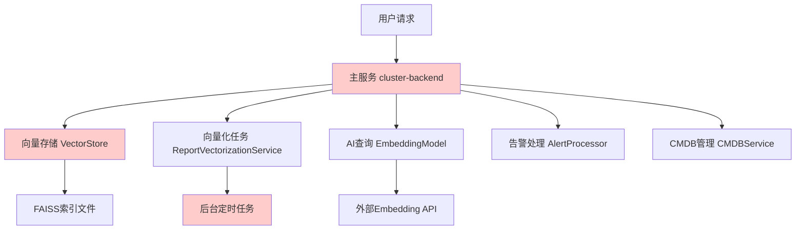
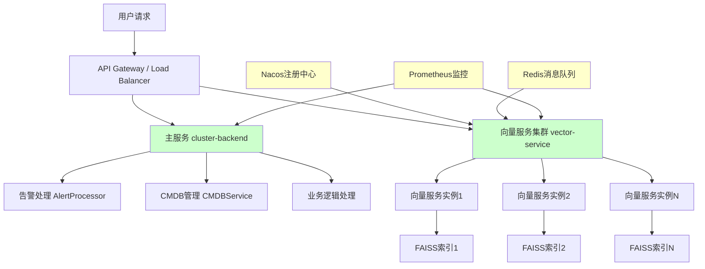
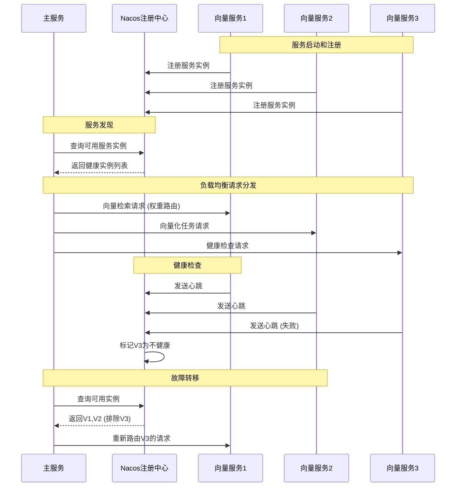
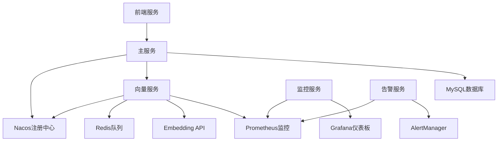

# 设计文档: 向量数据库微服务化改造

## 概述

本设计文档描述了集群管理平台向量数据库模块的微服务化改造方案。当前向量数据库模块与主业务服务耦合，导致性能影响和资源竞争问题。通过实施第3阶段完整微服务化架构，将向量存储、向量化任务、检索功能独立部署，实现性能隔离、高可用性和弹性扩展。

改造目标包括：CPU使用率降低30-50%，内存减少1-2GB，响应时间提升20-40%，并发能力提升50-100%。核心技术方案采用Nacos服务发现、Redis异步队列、Docker容器化部署和Prometheus监控体系。

## 架构设计

### 当前架构问题分析



**问题识别**：
- 向量化任务每5分钟全量扫描，占用主线程资源
- FAISS索引常驻内存，启动时加载较慢
- 向量检索与业务逻辑竞争CPU/内存资源
- 单点故障风险，向量服务异常影响整体系统

### 目标微服务架构



## 组件和接口设计

### 核心组件架构

#### 1. 向量服务 (Vector Service)

**职责**：
- 向量存储和检索
- 向量化任务处理
- 索引管理和优化
- 健康检查和监控

**接口定义**：
```python
from typing import List, Dict, Any, Optional
from pydantic import BaseModel

class VectorSearchRequest(BaseModel):
    query_vector: List[float]
    top_k: int = 10
    threshold: float = 0.0
    filters: Optional[Dict[str, Any]] = None

class VectorSearchResponse(BaseModel):
    success: bool
    data: List[Dict[str, Any]]
    total: int
    latency_ms: float

class VectorizeRequest(BaseModel):
    text: str
    metadata: Optional[Dict[str, Any]] = None
    priority: int = 1

class VectorizeResponse(BaseModel):
    success: bool
    vector_id: Optional[str] = None
    vector: Optional[List[float]] = None
    error: Optional[str] = None

# 向量服务接口
class VectorServiceInterface:
    async def search_vectors(self, request: VectorSearchRequest) -> VectorSearchResponse
    async def add_vector(self, vector: List[float], metadata: Dict[str, Any]) -> str
    async def update_vector(self, vector_id: str, vector: List[float], metadata: Dict[str, Any]) -> bool
    async def delete_vector(self, vector_id: str) -> bool
    async def vectorize_text(self, request: VectorizeRequest) -> VectorizeResponse
    async def health_check(self) -> Dict[str, Any]
    async def get_metrics(self) -> Dict[str, Any]
```

#### 2. 服务注册中心 (Nacos)

**职责**：
- 服务注册和发现
- 健康检查
- 配置管理
- 负载均衡

**配置模型**：
```python
class ServiceConfig(BaseModel):
    service_name: str
    instance_id: str
    ip: str
    port: int
    weight: float = 1.0
    healthy: bool = True
    metadata: Dict[str, str] = {}

class NacosConfig(BaseModel):
    server_addr: str
    namespace: str = "public"
    group: str = "DEFAULT_GROUP"
    username: Optional[str] = None
    password: Optional[str] = None
```

#### 3. 消息队列服务 (Redis Queue)

**职责**：
- 异步任务队列
- 任务优先级管理
- 失败重试机制
- 任务状态跟踪

**队列模型**：
```python
class QueueTask(BaseModel):
    task_id: str
    task_type: str  # vectorize, index_rebuild, cleanup
    payload: Dict[str, Any]
    priority: int = 1
    retry_count: int = 0
    max_retries: int = 3
    created_at: datetime
    scheduled_at: Optional[datetime] = None

class QueueConfig(BaseModel):
    redis_url: str
    queue_name: str = "vector_tasks"
    max_workers: int = 4
    batch_size: int = 10
    visibility_timeout: int = 300
```
## 数据模型设计

### 向量存储数据模型

```python
class VectorEntry(BaseModel):
    """向量条目数据模型"""
    id: str
    vector: List[float]
    metadata: Dict[str, Any]
    created_at: datetime
    updated_at: datetime
    version: int = 1
    status: str = "active"  # active, deleted, processing

class VectorIndex(BaseModel):
    """向量索引元数据"""
    index_id: str
    dimension: int
    total_vectors: int
    index_type: str = "faiss"
    created_at: datetime
    last_updated: datetime
    file_path: str
    checksum: str

class ServiceInstance(BaseModel):
    """服务实例信息"""
    instance_id: str
    service_name: str
    host: str
    port: int
    status: str = "healthy"  # healthy, unhealthy, starting, stopping
    load: float = 0.0
    last_heartbeat: datetime
    metadata: Dict[str, Any] = {}
```

### 任务队列数据模型

```python
class VectorizeTask(BaseModel):
    """向量化任务"""
    task_id: str
    source_type: str  # report, knowledge, routing_rule
    source_id: str
    text_content: str
    priority: int = 1
    status: str = "pending"  # pending, processing, completed, failed
    created_at: datetime
    started_at: Optional[datetime] = None
    completed_at: Optional[datetime] = None
    error_message: Optional[str] = None
    retry_count: int = 0

class IndexRebuildTask(BaseModel):
    """索引重建任务"""
    task_id: str
    index_type: str
    total_entries: int
    processed_entries: int = 0
    status: str = "pending"
    progress: float = 0.0
    estimated_completion: Optional[datetime] = None
```

## 主要算法和工作流程

### 服务发现和负载均衡算法



### 异步向量化处理算法

```python
async def process_vectorization_queue():
    """
    异步向量化队列处理算法
    
    前置条件:
    - Redis队列服务可用
    - Embedding API服务可用
    - 向量存储服务可用
    
    后置条件:
    - 所有任务按优先级处理
    - 失败任务自动重试
    - 处理状态正确更新
    """
    while True:
        try:
            # 批量获取任务 (优先级排序)
            tasks = await queue.get_batch(
                batch_size=BATCH_SIZE,
                timeout=QUEUE_TIMEOUT
            )
            
            if not tasks:
                await asyncio.sleep(POLL_INTERVAL)
                continue
            
            # 并行处理任务批次
            results = await asyncio.gather(
                *[process_single_task(task) for task in tasks],
                return_exceptions=True
            )
            
            # 处理结果和错误
            for task, result in zip(tasks, results):
                if isinstance(result, Exception):
                    await handle_task_failure(task, result)
                else:
                    await handle_task_success(task, result)
                    
        except Exception as e:
            logger.error(f"队列处理异常: {e}")
            await asyncio.sleep(ERROR_BACKOFF)

async def process_single_task(task: VectorizeTask) -> VectorizeResponse:
    """
    单个向量化任务处理
    
    前置条件:
    - task.text_content 非空
    - task.status == "pending"
    
    后置条件:
    - 返回向量化结果或异常
    - 任务状态更新为 completed/failed
    """
    try:
        # 更新任务状态
        task.status = "processing"
        task.started_at = datetime.utcnow()
        await update_task_status(task)
        
        # 调用Embedding API
        vector = await embedding_client.vectorize(task.text_content)
        
        # 存储向量
        vector_id = await vector_store.add_vector(
            vector=vector,
            metadata={
                "source_type": task.source_type,
                "source_id": task.source_id,
                "task_id": task.task_id
            }
        )
        
        # 更新任务完成状态
        task.status = "completed"
        task.completed_at = datetime.utcnow()
        await update_task_status(task)
        
        return VectorizeResponse(
            success=True,
            vector_id=vector_id,
            vector=vector
        )
        
    except Exception as e:
        # 处理失败，准备重试
        task.retry_count += 1
        task.error_message = str(e)
        
        if task.retry_count >= task.max_retries:
            task.status = "failed"
        else:
            task.status = "pending"
            # 指数退避重试
            task.scheduled_at = datetime.utcnow() + timedelta(
                seconds=2 ** task.retry_count * RETRY_BASE_DELAY
            )
        
        await update_task_status(task)
        raise e
```

### 向量检索优化算法

```python
async def optimized_vector_search(
    query_vector: List[float],
    top_k: int = 10,
    threshold: float = 0.0,
    filters: Optional[Dict[str, Any]] = None
) -> VectorSearchResponse:
    """
    优化的向量检索算法
    
    前置条件:
    - query_vector 维度正确 (768维)
    - top_k > 0 且 <= MAX_TOP_K
    - 至少一个向量服务实例可用
    
    后置条件:
    - 返回相似度排序的结果
    - 响应时间 < SEARCH_TIMEOUT
    - 结果数量 <= top_k
    
    循环不变式:
    - 所有返回结果的相似度 >= threshold
    - 结果按相似度降序排列
    """
    start_time = time.time()
    
    try:
        # 获取可用的向量服务实例
        available_instances = await service_discovery.get_healthy_instances(
            service_name="vector-service"
        )
        
        if not available_instances:
            raise ServiceUnavailableError("没有可用的向量服务实例")
        
        # 选择负载最低的实例
        selected_instance = min(
            available_instances,
            key=lambda x: x.load
        )
        
        # 执行向量检索
        client = get_vector_client(selected_instance)
        
        # 应用预过滤优化
        if filters:
            filtered_indices = await apply_metadata_filters(filters)
            search_space = filtered_indices
        else:
            search_space = None
        
        # FAISS检索
        similarities, indices = await client.search(
            query_vector=query_vector,
            top_k=min(top_k * 2, MAX_SEARCH_K),  # 过采样
            search_space=search_space
        )
        
        # 后处理和阈值过滤
        results = []
        for sim, idx in zip(similarities, indices):
            if sim >= threshold:
                metadata = await client.get_metadata(idx)
                results.append({
                    "id": metadata["id"],
                    "similarity": float(sim),
                    "metadata": metadata
                })
        
        # 截取最终结果
        final_results = results[:top_k]
        
        latency_ms = (time.time() - start_time) * 1000
        
        return VectorSearchResponse(
            success=True,
            data=final_results,
            total=len(final_results),
            latency_ms=latency_ms
        )
        
    except Exception as e:
        logger.error(f"向量检索失败: {e}")
        return VectorSearchResponse(
            success=False,
            data=[],
            total=0,
            latency_ms=(time.time() - start_time) * 1000
        )
```

## 关键函数的形式化规范

### 函数1: 服务注册

```python
async def register_service_instance(
    service_name: str,
    instance_config: ServiceConfig
) -> bool:
    """服务实例注册函数"""
    pass
```

**前置条件:**
- `service_name` 非空字符串
- `instance_config.ip` 是有效IP地址
- `instance_config.port` 在有效端口范围内 (1-65535)
- Nacos服务可达

**后置条件:**
- 成功时返回 `True`，服务实例在Nacos中可查询
- 失败时返回 `False`，不影响现有注册状态
- 实例健康检查端点可访问

**循环不变式:** N/A (非循环函数)

### 函数2: 负载均衡选择

```python
async def select_best_instance(
    service_name: str,
    strategy: str = "weighted_round_robin"
) -> Optional[ServiceInstance]:
    """负载均衡实例选择函数"""
    pass
```

**前置条件:**
- `service_name` 在注册中心存在
- 至少有一个健康的服务实例
- `strategy` 是支持的负载均衡策略

**后置条件:**
- 返回负载最优的健康实例
- 如果无可用实例，返回 `None`
- 选择结果符合负载均衡策略

**循环不变式:**
- 遍历实例列表时，已检查的实例都是健康的
- 当前最优实例的负载 <= 所有已检查实例的负载

### 函数3: 向量批量处理

```python
async def batch_vectorize_texts(
    texts: List[str],
    batch_size: int = 32
) -> List[VectorizeResponse]:
    """批量文本向量化函数"""
    pass
```

**前置条件:**
- `texts` 列表非空，每个文本长度 <= MAX_TEXT_LENGTH
- `batch_size` > 0 且 <= MAX_BATCH_SIZE
- Embedding API服务可用

**后置条件:**
- 返回结果列表长度等于输入文本数量
- 成功的向量维度为 EMBEDDING_DIMENSION
- 失败的响应包含错误信息

**循环不变式:**
- 处理每个批次时，已处理的文本数量正确累计
- 每个批次的大小 <= batch_size
- 所有成功的向量维度一致

## 示例用法

### 基本向量检索

```python
# 示例1: 基本向量检索
async def example_vector_search():
    # 初始化向量服务客户端
    vector_client = VectorServiceClient(
        service_discovery=nacos_client,
        service_name="vector-service"
    )
    
    # 准备查询向量
    query_text = "硬件告警诊断"
    query_vector = await embedding_client.vectorize(query_text)
    
    # 执行检索
    request = VectorSearchRequest(
        query_vector=query_vector,
        top_k=10,
        threshold=0.7,
        filters={"source_type": "knowledge"}
    )
    
    response = await vector_client.search_vectors(request)
    
    if response.success:
        print(f"找到 {response.total} 个相关结果")
        for item in response.data:
            print(f"相似度: {item['similarity']:.3f}, ID: {item['id']}")
    else:
        print("检索失败")

# 示例2: 异步向量化任务
async def example_async_vectorization():
    # 创建向量化任务
    task = VectorizeTask(
        task_id=str(uuid.uuid4()),
        source_type="report",
        source_id="report_123",
        text_content="系统性能分析报告...",
        priority=1
    )
    
    # 提交到队列
    queue_client = RedisQueueClient(redis_url=REDIS_URL)
    await queue_client.enqueue(task)
    
    print(f"任务 {task.task_id} 已提交到队列")

# 示例3: 服务健康检查
async def example_health_monitoring():
    service_discovery = NacosServiceDiscovery(
        server_addr="nacos:8848",
        namespace="vector-services"
    )
    
    # 获取所有向量服务实例
    instances = await service_discovery.get_all_instances("vector-service")
    
    for instance in instances:
        health_status = await check_instance_health(instance)
        print(f"实例 {instance.instance_id}: {health_status}")
        
        if not health_status["healthy"]:
            # 自动故障转移
            await service_discovery.mark_instance_unhealthy(instance.instance_id)
```

### 完整工作流程示例

```python
async def complete_workflow_example():
    """完整的微服务化向量处理工作流程"""
    
    # 1. 初始化服务组件
    nacos_client = NacosClient(server_addr="nacos:8848")
    vector_client = VectorServiceClient(service_discovery=nacos_client)
    queue_client = RedisQueueClient(redis_url="redis://redis:6379")
    
    # 2. 提交向量化任务
    texts_to_vectorize = [
        "硬件故障诊断报告",
        "网络连接异常分析",
        "系统性能优化建议"
    ]
    
    tasks = []
    for i, text in enumerate(texts_to_vectorize):
        task = VectorizeTask(
            task_id=f"task_{i}",
            source_type="knowledge",
            source_id=f"kb_{i}",
            text_content=text,
            priority=1
        )
        await queue_client.enqueue(task)
        tasks.append(task)
    
    # 3. 等待任务完成
    completed_tasks = await wait_for_tasks_completion(tasks, timeout=300)
    print(f"完成 {len(completed_tasks)} 个向量化任务")
    
    # 4. 执行向量检索
    query_text = "硬件故障"
    query_vector = await embedding_client.vectorize(query_text)
    
    search_request = VectorSearchRequest(
        query_vector=query_vector,
        top_k=5,
        threshold=0.6
    )
    
    search_response = await vector_client.search_vectors(search_request)
    
    # 5. 处理检索结果
    if search_response.success:
        print(f"检索耗时: {search_response.latency_ms:.2f}ms")
        for result in search_response.data:
            print(f"匹配项: {result['metadata']['source_id']}, "
                  f"相似度: {result['similarity']:.3f}")
    
    return search_response
```
## 正确性属性

基于前期分析，以下是系统必须满足的正确性属性：

### 属性1: 服务发现一致性
```python
# 对于所有时间点t，如果服务实例在Nacos中注册为健康状态，
# 那么该实例必须能够响应健康检查请求
∀t, instance: (nacos.is_healthy(instance, t) → instance.health_check_responds(t))
```

### 属性2: 负载均衡公平性
```python
# 在稳定状态下，请求应该根据实例权重公平分发
∀instances, requests: (
    steady_state(instances) → 
    request_distribution_matches_weights(instances, requests)
)
```

### 属性3: 向量化任务完整性
```python
# 所有成功提交的向量化任务最终都会被处理（成功或失败）
∀task: (enqueued(task) → eventually(completed(task) ∨ failed(task)))
```

### 属性4: 向量检索一致性
```python
# 相同的查询向量在相同的索引状态下应该返回相同的结果
∀query_vector, index_state: (
    search(query_vector, index_state) = search(query_vector, index_state)
)
```

### 属性5: 故障转移及时性
```python
# 当服务实例故障时，必须在最大故障检测时间内被发现并标记
∀instance: (
    instance_fails(instance, t) → 
    ∃t': (t' ≤ t + MAX_FAILURE_DETECTION_TIME ∧ marked_unhealthy(instance, t'))
)
```

### 属性6: 数据一致性保证
```python
# 向量数据的添加、更新、删除操作必须保持ACID特性
∀operation: (
    vector_operation(operation) → 
    (atomic(operation) ∧ consistent(operation) ∧ isolated(operation) ∧ durable(operation))
)
```

### 属性7: 性能提升目标
```python
# 微服务化后的性能指标必须达到预期目标
cpu_usage_reduction ≥ 0.30 ∧
memory_reduction ≥ 1.0GB ∧
response_time_improvement ≥ 0.20 ∧
throughput_improvement ≥ 0.50
```

### 属性8: 向后兼容性
```python
# 现有API接口的行为必须保持不变
∀api_call, input: (
    old_system_response(api_call, input) = new_system_response(api_call, input)
)
```

## 错误处理策略

### 错误场景1: 向量服务不可用

**条件**: 所有向量服务实例都无法访问
**响应**: 
- 返回缓存的检索结果（如果可用）
- 降级到基于关键词的检索
- 记录错误日志并触发告警

**恢复策略**:
- 自动重试机制（指数退避）
- 服务实例自动重启
- 手动故障转移到备用集群

### 错误场景2: Nacos注册中心故障

**条件**: Nacos服务不可访问
**响应**:
- 使用本地缓存的服务实例列表
- 直接连接已知的服务实例
- 启用静态配置模式

**恢复策略**:
- Nacos集群部署保证高可用
- 定期备份服务注册信息
- 监控Nacos健康状态

### 错误场景3: Redis队列服务异常

**条件**: Redis连接失败或队列阻塞
**响应**:
- 切换到同步处理模式
- 使用内存队列作为临时缓冲
- 限制新任务的提交速率

**恢复策略**:
- Redis主从复制保证可用性
- 队列监控和自动清理
- 任务持久化到数据库

### 错误场景4: 向量索引损坏

**条件**: FAISS索引文件损坏或不一致
**响应**:
- 自动切换到备份索引
- 启动索引重建任务
- 暂时禁用受影响的服务实例

**恢复策略**:
- 定期创建索引备份
- 索引校验和完整性检查
- 增量索引重建机制

## 测试策略

### 单元测试方法

**测试覆盖范围**:
- 向量服务核心功能（存储、检索、更新）
- 服务发现和注册逻辑
- 负载均衡算法
- 队列任务处理
- 错误处理和恢复机制

**关键测试用例**:
```python
class TestVectorService:
    def test_vector_search_accuracy(self):
        """测试向量检索准确性"""
        pass
    
    def test_service_registration(self):
        """测试服务注册功能"""
        pass
    
    def test_load_balancing(self):
        """测试负载均衡策略"""
        pass
    
    def test_failure_recovery(self):
        """测试故障恢复机制"""
        pass
```

### 属性测试方法

**测试库**: Hypothesis (Python)

**属性测试用例**:
```python
from hypothesis import given, strategies as st

@given(
    query_vector=st.lists(st.floats(min_value=-1.0, max_value=1.0), 
                         min_size=768, max_size=768),
    top_k=st.integers(min_value=1, max_value=100)
)
def test_search_result_count_property(query_vector, top_k):
    """属性测试: 检索结果数量不超过top_k"""
    response = vector_service.search(query_vector, top_k)
    assert len(response.data) <= top_k

@given(
    texts=st.lists(st.text(min_size=1, max_size=1000), min_size=1, max_size=100)
)
def test_vectorization_completeness_property(texts):
    """属性测试: 向量化任务完整性"""
    tasks = [create_vectorize_task(text) for text in texts]
    results = process_batch_vectorization(tasks)
    assert len(results) == len(texts)
    assert all(r.success or r.error for r in results)
```

### 集成测试方法

**测试环境**: Docker Compose测试环境

**集成测试场景**:
- 端到端向量检索流程
- 服务故障转移测试
- 负载均衡效果验证
- 性能基准测试

**测试脚本示例**:
```python
async def test_end_to_end_vector_search():
    """端到端向量检索集成测试"""
    # 1. 启动所有服务
    await start_test_services()
    
    # 2. 注册测试数据
    test_vectors = generate_test_vectors(1000)
    for vector in test_vectors:
        await vector_service.add_vector(vector)
    
    # 3. 执行检索测试
    query_vector = generate_random_vector()
    response = await vector_service.search(query_vector, top_k=10)
    
    # 4. 验证结果
    assert response.success
    assert len(response.data) <= 10
    assert all(item['similarity'] >= 0 for item in response.data)
    
    # 5. 清理测试环境
    await cleanup_test_services()
```

## 性能考虑

### 性能优化策略

**1. 向量检索优化**:
- 使用FAISS GPU加速（如果可用）
- 实现分层索引结构
- 预计算常用查询的结果缓存
- 批量检索减少网络开销

**2. 服务通信优化**:
- 使用连接池减少连接开销
- 实现请求批处理
- 启用gRPC流式传输
- 压缩大型响应数据

**3. 内存管理优化**:
- 向量索引分片存储
- 实现LRU缓存策略
- 定期内存垃圾回收
- 监控内存使用情况

### 性能监控指标

**关键性能指标 (KPIs)**:
- 向量检索延迟 (P50, P95, P99)
- 服务吞吐量 (QPS)
- 内存使用率
- CPU使用率
- 网络I/O
- 错误率

**监控实现**:
```python
class PerformanceMonitor:
    def __init__(self):
        self.metrics = {
            'search_latency': Histogram('vector_search_latency_seconds'),
            'search_qps': Counter('vector_search_requests_total'),
            'memory_usage': Gauge('vector_service_memory_bytes'),
            'cpu_usage': Gauge('vector_service_cpu_percent'),
            'error_rate': Counter('vector_service_errors_total')
        }
    
    def record_search_latency(self, latency_seconds: float):
        self.metrics['search_latency'].observe(latency_seconds)
    
    def increment_search_count(self):
        self.metrics['search_qps'].inc()
    
    def update_resource_usage(self, memory_bytes: int, cpu_percent: float):
        self.metrics['memory_usage'].set(memory_bytes)
        self.metrics['cpu_usage'].set(cpu_percent)
```

## 安全考虑

### 安全威胁模型

**威胁1: 未授权访问向量数据**
- 风险: 敏感向量数据泄露
- 缓解措施: API认证、访问控制、数据加密

**威胁2: 服务间通信劫持**
- 风险: 请求被拦截或篡改
- 缓解措施: TLS加密、服务网格、证书管理

**威胁3: 拒绝服务攻击**
- 风险: 恶意请求导致服务不可用
- 缓解措施: 限流、熔断、异常检测

### 安全实现措施

**1. 认证和授权**:
```python
class SecurityMiddleware:
    async def authenticate_request(self, request):
        """请求认证中间件"""
        token = request.headers.get('Authorization')
        if not token:
            raise UnauthorizedError("缺少认证令牌")
        
        user_info = await verify_jwt_token(token)
        request.user = user_info
        return request
    
    async def authorize_vector_access(self, user, vector_id):
        """向量访问授权检查"""
        if not await check_vector_permission(user.id, vector_id):
            raise ForbiddenError("无权访问该向量数据")
```

**2. 数据加密**:
- 传输加密: TLS 1.3
- 存储加密: AES-256
- 密钥管理: HashiCorp Vault

**3. 审计日志**:
```python
class AuditLogger:
    async def log_vector_access(self, user_id: str, vector_id: str, action: str):
        """记录向量访问审计日志"""
        audit_event = {
            'timestamp': datetime.utcnow().isoformat(),
            'user_id': user_id,
            'resource_type': 'vector',
            'resource_id': vector_id,
            'action': action,
            'ip_address': get_client_ip(),
            'user_agent': get_user_agent()
        }
        await self.write_audit_log(audit_event)
```

## 依赖关系

### 外部依赖

**核心依赖**:
- **Nacos**: 服务注册与发现 (v2.2.0+)
- **Redis**: 消息队列和缓存 (v7.0+)
- **FAISS**: 向量索引和检索 (v1.7.4+)
- **Docker**: 容器化部署 (v20.10+)
- **Prometheus**: 监控和告警 (v2.40+)

**Python依赖**:
```python
# requirements.txt
fastapi>=0.104.0
uvicorn>=0.24.0
nacos-sdk-python>=0.1.5
redis>=5.0.0
faiss-cpu>=1.7.4  # 或 faiss-gpu
numpy>=1.24.0
pydantic>=2.0.0
httpx>=0.25.0
prometheus-client>=0.19.0
```

**系统依赖**:
- Linux内核 4.15+ (Docker支持)
- Python 3.9+
- 内存: 最少8GB，推荐16GB+
- 存储: SSD，最少100GB可用空间
- 网络: 千兆以太网

### 服务依赖关系



### 部署依赖

**最小部署配置**:
- 1个Nacos实例
- 1个Redis实例  
- 2个向量服务实例
- 1个主服务实例
- 1个Prometheus实例

**生产部署配置**:
- 3个Nacos实例（集群）
- 2个Redis实例（主从）
- 4个向量服务实例（负载均衡）
- 2个主服务实例（高可用）
- 3个Prometheus实例（联邦）

## 部署和运维

### Docker Compose配置

**新增向量服务配置**:
```yaml
# docker-compose.microservices.yml
version: '3.8'

services:
  # Nacos服务注册中心
  nacos:
    image: nacos/nacos-server:v2.2.0
    container_name: cluster-nacos
    environment:
      MODE: standalone
      SPRING_DATASOURCE_PLATFORM: mysql
      MYSQL_SERVICE_HOST: mysql
      MYSQL_SERVICE_DB_NAME: nacos
      MYSQL_SERVICE_USER: ${MYSQL_USER}
      MYSQL_SERVICE_PASSWORD: ${MYSQL_PASSWORD}
    ports:
      - "8848:8848"
      - "9848:9848"
    depends_on:
      - mysql
    networks:
      - cluster-network
    healthcheck:
      test: ["CMD", "curl", "-f", "http://localhost:8848/nacos/v1/ns/operator/metrics"]
      interval: 30s
      timeout: 10s
      retries: 5

  # 向量服务实例1
  vector-service-1:
    build:
      context: ./vector-service
      dockerfile: Dockerfile
    image: vector-service:latest
    container_name: cluster-vector-1
    environment:
      INSTANCE_ID: vector-service-1
      NACOS_SERVER: nacos:8848
      REDIS_URL: redis://redis:6379
      EMBEDDING_API_URL: ${EMBEDDING_API_URL}
      VECTOR_DIMENSION: 768
      INDEX_PATH: /app/vector_store/index_1
    ports:
      - "8001:8000"
    volumes:
      - vector_store_1:/app/vector_store
    depends_on:
      - nacos
      - redis
    networks:
      - cluster-network
    healthcheck:
      test: ["CMD", "curl", "-f", "http://localhost:8000/health"]
      interval: 15s
      timeout: 5s
      retries: 3

  # 向量服务实例2
  vector-service-2:
    build:
      context: ./vector-service
      dockerfile: Dockerfile
    image: vector-service:latest
    container_name: cluster-vector-2
    environment:
      INSTANCE_ID: vector-service-2
      NACOS_SERVER: nacos:8848
      REDIS_URL: redis://redis:6379
      EMBEDDING_API_URL: ${EMBEDDING_API_URL}
      VECTOR_DIMENSION: 768
      INDEX_PATH: /app/vector_store/index_2
    ports:
      - "8002:8000"
    volumes:
      - vector_store_2:/app/vector_store
    depends_on:
      - nacos
      - redis
    networks:
      - cluster-network
    healthcheck:
      test: ["CMD", "curl", "-f", "http://localhost:8000/health"]
      interval: 15s
      timeout: 5s
      retries: 3

  # Prometheus监控
  prometheus:
    image: prom/prometheus:v2.40.0
    container_name: cluster-prometheus
    ports:
      - "9090:9090"
    volumes:
      - ./monitoring/prometheus.yml:/etc/prometheus/prometheus.yml
      - prometheus_data:/prometheus
    command:
      - '--config.file=/etc/prometheus/prometheus.yml'
      - '--storage.tsdb.path=/prometheus'
      - '--web.console.libraries=/etc/prometheus/console_libraries'
      - '--web.console.templates=/etc/prometheus/consoles'
    networks:
      - cluster-network

volumes:
  vector_store_1:
  vector_store_2:
  prometheus_data:
```

### 部署脚本更新

**更新deploy.sh**:
```bash
#!/bin/bash
# 微服务化部署脚本

echo "开始微服务化部署..."

# 1. 构建向量服务镜像
echo "构建向量服务镜像..."
docker build -t vector-service:latest ./vector-service/

# 2. 启动基础服务
echo "启动基础服务..."
docker compose -f docker-compose.prod.yml up -d mysql redis minio

# 3. 等待基础服务就绪
echo "等待基础服务就绪..."
sleep 30

# 4. 启动Nacos
echo "启动Nacos服务..."
docker compose -f docker-compose.microservices.yml up -d nacos

# 5. 等待Nacos就绪
echo "等待Nacos就绪..."
sleep 20

# 6. 启动向量服务集群
echo "启动向量服务集群..."
docker compose -f docker-compose.microservices.yml up -d vector-service-1 vector-service-2

# 7. 启动主服务（更新配置）
echo "启动主服务..."
docker compose -f docker-compose.prod.yml up -d backend

# 8. 启动前端和监控
echo "启动前端和监控服务..."
docker compose -f docker-compose.prod.yml up -d frontend
docker compose -f docker-compose.microservices.yml up -d prometheus

echo "微服务化部署完成！"
echo "访问地址："
echo "- 前端: http://localhost:8089"
echo "- Nacos: http://localhost:8848/nacos"
echo "- Prometheus: http://localhost:9090"
echo "- 向量服务1: http://localhost:8001"
echo "- 向量服务2: http://localhost:8002"
```

### 监控配置

**Prometheus配置**:
```yaml
# monitoring/prometheus.yml
global:
  scrape_interval: 15s
  evaluation_interval: 15s

scrape_configs:
  - job_name: 'vector-services'
    static_configs:
      - targets: ['vector-service-1:8000', 'vector-service-2:8000']
    metrics_path: '/metrics'
    scrape_interval: 10s

  - job_name: 'main-service'
    static_configs:
      - targets: ['backend:8000']
    metrics_path: '/metrics'
    scrape_interval: 15s

  - job_name: 'nacos'
    static_configs:
      - targets: ['nacos:8848']
    metrics_path: '/nacos/actuator/prometheus'
    scrape_interval: 30s

rule_files:
  - "alert_rules.yml"

alerting:
  alertmanagers:
    - static_configs:
        - targets:
          - alertmanager:9093
```

### 运维手册

**常用运维命令**:
```bash
# 查看所有服务状态
docker compose -f docker-compose.microservices.yml ps

# 查看向量服务日志
docker compose -f docker-compose.microservices.yml logs vector-service-1 -f

# 重启向量服务
docker compose -f docker-compose.microservices.yml restart vector-service-1

# 扩容向量服务
docker compose -f docker-compose.microservices.yml up -d --scale vector-service=4

# 查看Nacos注册的服务
curl "http://localhost:8848/nacos/v1/ns/instance/list?serviceName=vector-service"

# 查看Prometheus指标
curl "http://localhost:9090/api/v1/query?query=vector_search_latency_seconds"

# 健康检查
curl "http://localhost:8001/health"
curl "http://localhost:8002/health"
```

**故障排查流程**:
1. 检查服务容器状态
2. 查看服务日志
3. 验证Nacos注册状态
4. 检查网络连通性
5. 查看资源使用情况
6. 验证配置文件正确性

这个完整的技术设计文档涵盖了向量数据库微服务化改造的所有关键方面，从高层架构到具体实现，从性能优化到安全考虑，为项目实施提供了详细的技术指导。